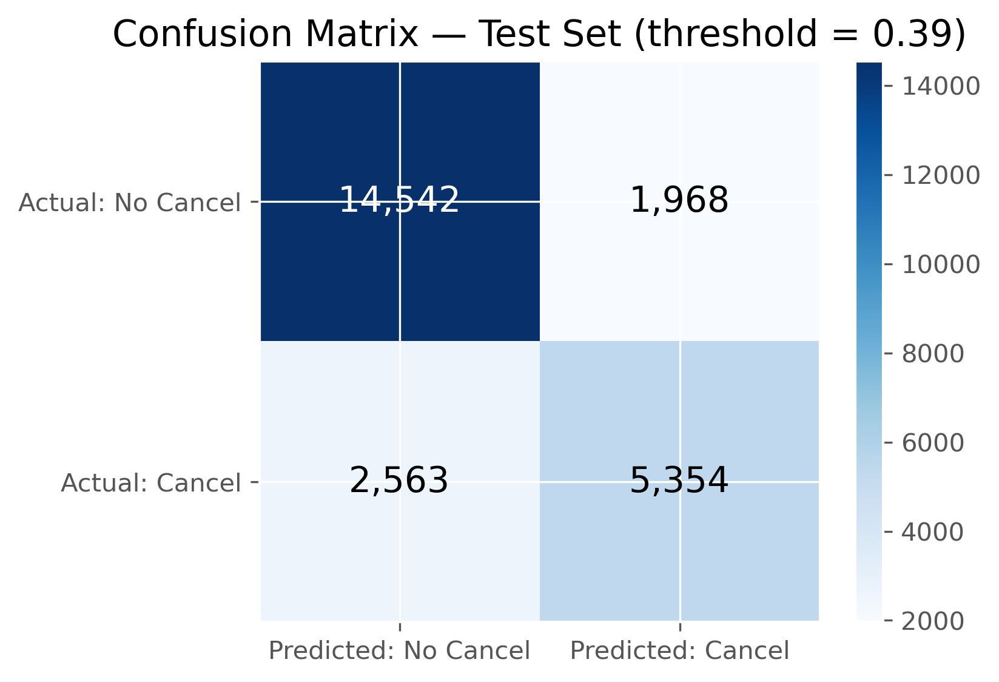
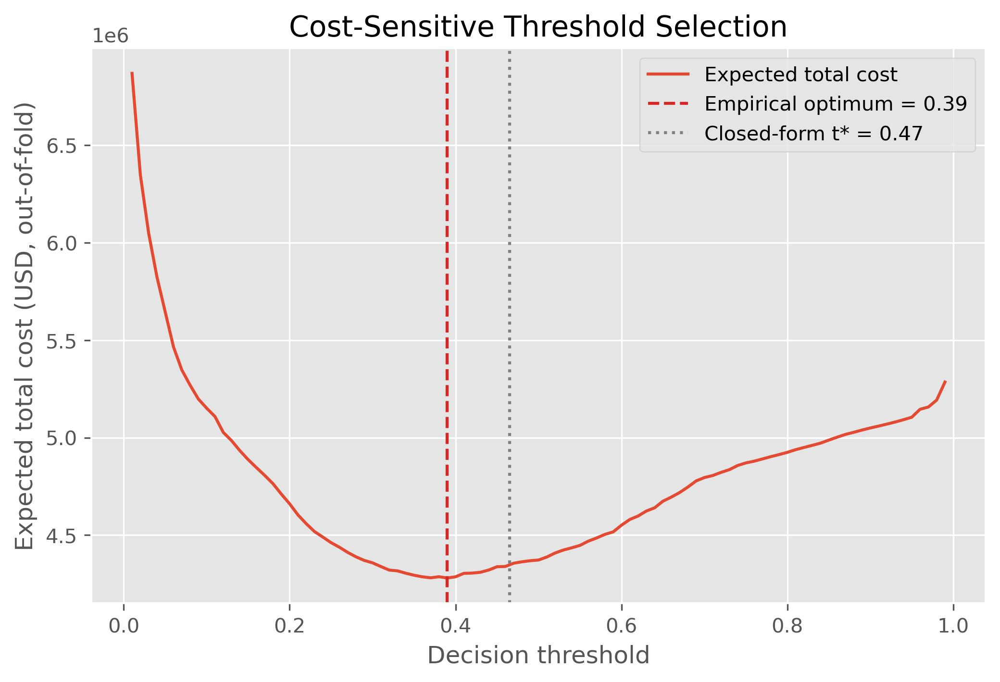

# Hotel Booking Cancellation Prediction

A machine learning project that predicts whether a hotel reservation will be canceled at the time of booking, enabling targeted retention campaigns before the cancellation happens.

This is a portfolio / course project (ML Zoomcamp). Full methodology, every decision log, and the complete EDA live in [`work-book-documentation.md`](work-book-documentation.md) and [`problem-framing-documentation.md`](problem-framing-documentation.md) — this README is a condensed summary.

**About the methodology:** the whole project was built following a personal data science methodology framework — a structured playbook plus a decision log, meant to be reused across projects regardless of domain. This project also served as a real-world test of that framework. The methodology repo is public here: [Methodology Repo](https://github.com/bruno-lima98/data-science-work-methodology).

## Problem

Hotels lose revenue when a reservation is canceled close to or at the arrival date, since the room could have been sold to another guest. The goal is to predict, **at booking time**, whether a reservation is likely to be canceled, so a retention action (contact + discount) can be triggered early enough to matter.

- **Unit of analysis:** one reservation.
- **Target:** `is_canceled` (binary).
- **Constraint:** only information available at the moment of booking can be used as a feature — anything generated afterward is excluded to avoid leakage.

Full business framing, cost assumptions, and success criteria: [`problem-framing-documentation.md`](problem-framing-documentation.md).

## Dataset

[Hotel Booking Demand](https://raw.githubusercontent.com/rfordatascience/tidytuesday/master/data/2020/2020-02-11/hotels.csv) (two Portuguese hotels, ~119k reservations, 2015–2017). Downloaded directly from the URL above — no manual download needed, `train.py` fetches it automatically.

## Approach

1. **Data cleaning** — dtype fixes, null handling (treated as informative categories, not imputed blindly), outlier correction, leakage columns dropped (`reservation_status*`, `assigned_room_type`).
2. **Train/test split** — out-of-time (OOT), split by derived `booking_date`, after discovering and correcting a date-collection selection bias at both ends of the dataset.
3. **EDA** — univariate AUC/Information Value per feature, temporal stability checks, adversarial validation, redundancy checks (Cramér's V, VIF).
4. **Model comparison** — Logistic Regression (baseline), XGBoost, LightGBM, CatBoost, compared via `TimeSeriesSplit` CV and a Nadeau-Bengio corrected test (no statistically significant difference among the three GBMs; CatBoost chosen for lowest variance and stronger native categorical handling).
5. **Hyperparameter tuning** — Optuna (30 trials, TPE sampler).
6. **Calibration check** — reliability diagram + Brier Skill Score on out-of-fold predictions.
7. **Decision threshold** — chosen by minimizing expected business cost (contact/discount cost vs. lost-reservation cost), not the default 0.5.
8. **Final evaluation** — single, one-time evaluation on the held-out test set.

## Results

| Metric | Value |
|---|---|
| Test AUC | 0.8838 (95% CI: 0.8795–0.8878) |
| Test AUPRC | 0.7857 |
| Precision / Recall / F1 (at threshold = 0.39) | 0.731 / 0.676 / 0.703 |
| Cost reduction vs. no model | 25.8% (≈ $472k on the test period) |

<p align="center">
  
  
</p>

CatBoost outperforms a Logistic Regression baseline by +0.035 AUC on the test set. Full error analysis by segment (including an investigated, explained weak spot on direct bookings) is in the workbook, Section 12.

## Project structure

```
.
├── main.ipynb                          # full exploratory notebook (EDA, model comparison, tuning)
├── train.py                            # trains the final model from scratch, reproducibly
├── predict.py                          # Flask service that serves the trained model
├── preprocessing.py                    # shared preprocessing transformer (train.py + predict.py)
├── test_predict.py                     # smoke test for the running service
├── tests/                              # sample request payloads
├── artifacts/models/                   # trained model + fitted preprocessor
├── Pipfile / Pipfile.lock              # dependencies (Pipenv)
├── Dockerfile / .dockerignore
├── work-book-documentation.md          # full decision log, section by section
└── problem-framing-documentation.md    # business framing, cost structure
```

## How to run

### 1. Install dependencies

```bash
pip install pipenv
pipenv install
pipenv install --dev
```

### 2. Train the model (optional — a trained model is already committed in `artifacts/models/`)

```bash
pipenv run python train.py
```

### 3. Run the prediction service locally

```bash
# Windows
pipenv run waitress-serve --listen=0.0.0.0:9696 predict:app

# Linux / macOS
pipenv run gunicorn --bind=0.0.0.0:9696 predict:app
```

### 4. Test it

```bash
pipenv run python test_predict.py
```

### 5. Or run it containerized (Docker)

```bash
docker build -t hotel-cancellation-service:v1 .
docker run -it --rm -p 9696:9696 hotel-cancellation-service:v1
```

Then, in another terminal, run step 4 again — it works the same way against the container.

### Example request

```bash
curl -X POST http://localhost:9696/predict \
  -H "Content-Type: application/json" \
  -d @tests/sample_will_cancel.json
```

Response:
```json
{
  "cancellation_probability": 0.8381,
  "threshold_used": 0.39,
  "will_cancel": true
}
```