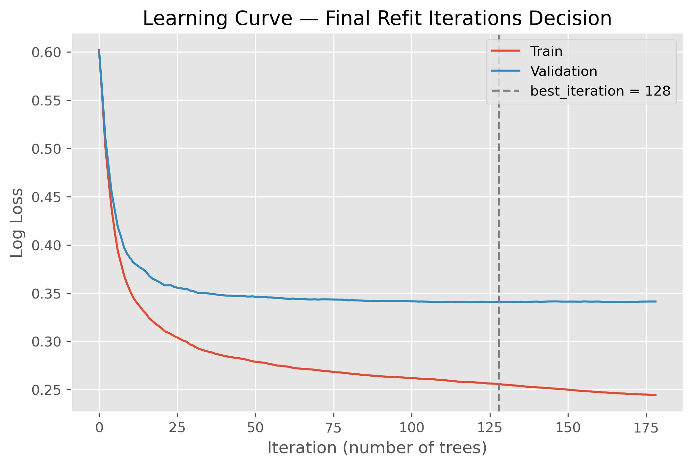
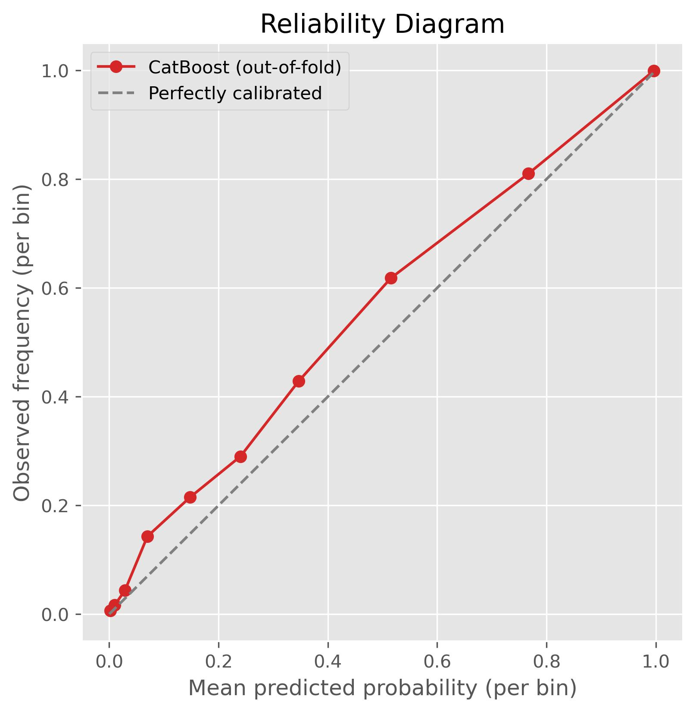

# PROJECT WORK BOOK

This document aims to record the entire step-by-step followed during implementation and serves as a complete guide to the decisions made and paths followed.

This project is a submission for the Midterm Project of the Machine Learning course promoted by DataTalks Club in 2026.

Beyond the course submission, this project also seeks to test the personal work methodology framework I developed, which lays out a structured way to follow a Data Science project.
- The steps from the methodology will be applied up to the point covered during the course (through lesson 6).
- Feedback on this framework will be recorded in this file for later adjustment.
- The framework can be found in the repository: **data-science-work-methodology**

## 1 - Problem Definition

The first step of the methodology adopted is creating a Problem Framing Documentation, where the idea is to answer the following questions before touching the data and starting exploration:

    1 - What business decision will the model inform?
    2 - What is the unit of analysis?
    3 - Is the target well defined and reliably observable?
    4 - Is there a current baseline (manual process, business rule, heuristic)?
    5 - What is the success criterion, locked in before running the first model?
    6 - Is there a regulatory or audit constraint that makes formal explainability a requirement, not a nice-to-have?
    7 - What is the reference date and the target's performance window?
    8 - Has the label already matured for all observations that will go into training?
    9 - Does the label depend on a decision the current process has already made about that case?
    10 - What is the operational response capacity, and how much does a False Positive and a False Negative cost (even roughly)?

To stay faithful to the step-by-step of this methodology, the **problem-framing-documentation.md** document was created, structuring the answers to these questions following the step-by-step.

## 2 - Data Collection

The collected data comes from a synthetic Kaggle base. Because of this, availability and verification cannot be validated. Here I laid out the dataset's structure and columns.

- **Link:** [Hotel Booking Dataset](https://www.kaggle.com/datasets/jessemostipak/hotel-booking-demand)
- **Total elements:** 119,390.
- **Cancellation rate:** 37.0%

| Column                         | Description |
|--------------------------------|----------------------------------------------|
| hotel                          | Hotel type (city, resort)
| lead_time                      | Time between booking and arrival
| arrival_date_year              | Arrival year
| arrival_date_month             | Arrival month
| arrival_date_week_number       | Arrival week number
| arrival_date_day_of_month      | Arrival day of month
| stays_in_weekend_nights        | Number of weekend nights in the booking
| stays_in_week_nights           | Number of week nights in the booking
| adults                         | Number of adults
| children                       | Number of children
| babies                         | Number of babies
| meal                           | Type of meal booked
| country                        | Country of origin
| market_segment                 | Market segment designation
| distribution_channel           | Booking distribution channel
| is_repeated_guest              | Is a repeat guest
| previous_cancellations         | Number of previously canceled bookings
| previous_bookings_not_canceled | Number of previously non-canceled bookings
| reserved_room_type             | Reserved room type
| assigned_room_type             | Room type assigned at check-in
| booking_changes                | Number of changes made to the booking
| deposit_type                   | Deposit type
| agent                          | Travel agency ID
| company                        | Company ID
| days_in_waiting_list           | Days on the waiting list before confirmation
| customer_type                  | Booking type
| adr                            | Average daily rate
| required_car_parking_spaces    | Number of required parking spaces
| total_of_special_requests      | Number of special requests made
| reservation_status              | Last reservation status
| reservation_status_date         | Date of the last status
| is_canceled                     | Target: indicates whether the booking was canceled or not

# 3. Data Quality and Cleaning

### 3.1. Initial Check

We ran some initial checks to validate the dataset.

- **Target check:** validation of the `is_canceled` column:
    - No null values.
    - No changes to its definition over time — it is only the cancellation information for the booking.
    - We have a 1/0 ratio of 37.04% (44,224 positive events).
- **Column types:** column typing was reviewed, requiring 3 changes:
    - `agent`: represents travel agencies, anonymized by number, was numeric -> converted to str.
    - `company`: represents companies/businesses, anonymized by number, was numeric -> converted to str
- **Column normalization:** all columns went through text normalization and all str columns had their values normalized.

### 3.2. Duplicate Values

When checking the total number of duplicate values, there were 32,252 occurrences, and a quick check of cancellation rates among duplicates showed:

- Cancellation rate [Original DF] = 0.3704
- Cancellation rate [DF without Duplicates] = 0.2728
- Cancellation rate [DF Duplicates only] = 0.6343

Looking specifically at the `market_segment`, `customer_type`, `deposit_type` columns, a high concentration was noticed in some categories, suggesting a systemic relationship with the dataset's anonymization.

So this information was kept for further investigation in section 4.

### 3.3. Null Values

The presence of null values in the dataset columns was assessed to understand the right strategy for each case and how to resolve it. This resulted in 4 columns:

- `children`: has 4 nulls (0.003%). Since the percentage is very low, the simple strategy of imputing the dataset's mode was chosen for these points.
- `country`: has 488 nulls (0.41%). Since it's categorical information about which country the reservation was made from, "unknown" was imputed, adding some signal about this information.
- `agent`: has 16,340 nulls (13.69%). Since this actually has a meaning — no travel agency intermediated the booking — "no_agency" was used.
- `company`: has 112,593 nulls (94.31%). Since this actually has a meaning — it's not a company making the booking — "no_company" was used.

### 3.4. Outliers

Outliers were checked in a simple way using describe(), to bring out-of-expected points for a more thorough investigation. At this first moment, there was only one point of attention:

`adr`: this column holds information about daily rates. However, it has two points of attention:
    - Negative value: -6.38 appears as the minimum value.
    - Very high value: 5,400 appears as the maximum value.

<p align="center">
  
</p>

Looking at the histogram, we can see these aren't values within expectations.

The negative value occurs in only 1 single event, suggesting it may have been some imputation issue. The value of 5,400 also appears to be some kind of typing error, given it's an isolated case, 10x larger than the 2nd largest value of ~500. Removing this value from the plot makes things much more plausible.

So the strategy adopted:
- Negative value: we used the absolute value.
- High value: we capped it at a reasonable value (500).

`adults`: this column reports the total number of adults in the booking. However, it has one point of attention:
    - Very high value: 55 appears as the maximum value.
    - Value 0: some cases appear with 0 adults in the booking.

<p align="center">
  
</p>

Looking at the histogram, we can see the concentration of values is between 1 and 5, which makes a lot more sense. Very high values don't make much sense when thinking about a hotel booking, since above 5 people, there are only 14 events. As for the values of 0 adults, it's also strange, even with a total of 403 rows.

So the strategy adopted:
- High value: values from other related fields indicated some imputation issue, so they were removed.
- Value 0: rows with 0 adults in the booking were removed as inconsistent with reality. In a real scenario, this would be blocked or flagged for correction.

Within this question, one more check came up: bookings that show 0 people (adults + children + babies), totaling 180 events.

### 3.5. Class Imbalance

In the current dataset, there is no imbalance problem that requires initial treatment. Besides an `is_canceled` = 1 rate of 37%, there is still a relatively high total in absolute number of events, with 44,224 events.

### 3.6. Discarded Information

When analyzing the information available in the dataset, two columns had to be discarded:
- `reservation_status` and `reservation_status_date`: these reflect the actual status of the booking and when the last status was updated. However, they are information that is not "available" at the moment of booking — they are a direct result of our target `is_canceled`.

# 4. Dataset Split

Before actually entering the EDA, let's do the dataset split, since our Test fold cannot be used for any kind of decision-making, remaining in total isolation from the analyses and decisions from now on. So the best way to do the split was studied.

Thinking of a temporal dataset, with bookings monitored over a 35-month period, the OOT strategy gains great value here, with training on the past for future predictions. The question that revolves around this strategy is the base date for the splits, since there is the arrival date but no date for when the booking itself was made, so we need to derive this from the available information.

Since we always have `lead_time` and `arrival_date` information, we can use them to find the booking date, which is actually the date used for a temporal split in this dataset. So we can assess the cancellation rate by booking date:

<p align="center">
  
</p>

We notice there's a problem using this directly. The fact that data collection did not use the booking date as a cutoff parameter generates a distortion when we observe the dates. Before 2015 we have sporadic cases of bookings being made, with a strange spike in Oct/24. When we look at the cancellation rate for these bookings relative to the rest of the dataset, we get:
- **Cancellation rate (before 2015)**: 90.16% [2,623 events].
- **Cancellation rate (post 2015):** 35.87%.

Given this, we chose to remove bookings before 2015 to avoid the distortion generated by this improper collection, since these events only entered the dataset due to a very high lead_time, causing this 90% cancellation distortion.

Additionally, one of the issues pointed out earlier was the amount of duplicates in the dataset. However, since the duplicate check was done without using a specific subset, the dates and lead_time that result in `booking_date` are always the same, meaning temporal cuts in the dataset always guarantee that duplicates fall into the same fold, avoiding leakage through duplicates.

<p align="center">
  
</p>

Another point of attention that was observed is the question of the right end of the dataset (most recent `booking_date`), to validate whether there's a `lead_time` bias issue being too low, i.e., a lower cancellation rate in these cases. It was already noticeable in the previous chart that there's a downward trend, and when we zoom in, we clearly see a much lower value at the right end.

With that, a closed range was defined for the dataset to remove noise: `2015-01-01` through `2017-06-30`, with a distribution given by:

<p align="center">
  
</p>

## 4.1. OOT

After all these considerations, it's necessary to actually apply the Out of Time technique to the dataset, where we will separate the most recent portion of the data as the Test dataset, while the remainder becomes the train/validation dataset, where we will run Cross-Validation using temporal cuts.

- **cutoff between Train / Test =** `2017-01-01`

- **Train:**
    - start date = `2015-01-01`.
    - end date = `2016-12-31`.
    - dataset size = 89,858 events.
    - percentage of the base = 78.63%.
    - cancellation rate = 37.11%

- **Test:**
    - start date = `2017-01-01`.
    - end date = `2017-06-30`.
    - dataset size = 24,427 events.
    - percentage of the base = 21.37%.
    - cancellation rate = 32.41%

> *PS: we still notice a lower cancellation rate in the test dataset from what we saw earlier, in which we have a bias of decreasing rate as we move further right in the dataset due to the distortion generated by the collection method, but we managed to reduce it to acceptable values.*

## 4.2. TimeSeriesSplit x Unique Validation

Since we selected the test slice earlier using OOT, we will keep the temporal split strategy in the dataset. One of the most interesting ones here is TimeSeriesSplit, which consists of splitting folds using a reference date to divide the dataset.

The points we need to be careful about when using this strategy and its pros/cons are laid out below:

  - **a) Model comparison:** since it will be necessary to make comparisons between models for a future choice, multiple paired folds will be needed, to ensure adequate statistical strength of comparison, eliminating bias or statistical errors — so a multi-split with temporal folds gains a lot of value here.

  - **b) Sample size:** when using this type of strategy it's necessary to ensure the sample is robust enough. In the current scenario we have 24 months of analysis (OOT split) with 89,858 events, which seems to support a split like this without the risk of micro folds or similar issues. For example, if we have 5 splits, we'll have at least 4 months in each one.

  - **c) Computational cost:** one caution needed, however, is the computational expense that future tuning using this strategy will generate. Since we have around 90 thousand rows, this doesn't become a very alarming problem, but it's necessary to monitor this kind of practice.

  - **d) Expanding window x Sliding window:** there are two strategies within TimeSeriesSplit, where the first uses cumulative folds, meaning the next fold (further into the future) aggregates the data from the previous fold, so data further in the past also trains that fold. Or we have the second, where each fold cuts a fixed time window, and as the fold moves forward, past data isn't used. Since we don't have a problem of changing target/booking behavior, and our time window isn't that large, we'll adopt the initial strategy of cumulative folds.

# 5. Exploratory Data Analysis (EDA)

Now we'll start actually looking at the data. However, we must do any type of exploration without ever looking at the test dataset, as this could cause leakage or similar issues, so we'll focus on the training dataset.

## 5.1. Univariate AUC

The first simple test is to check whether the features individually already carry some kind of information about the target (and also check that there isn't leakage if some value comes out too high). So the test was applied and some results that make sense when we think about the booking itself were obtained, among which we can highlight:

- `lead_time`: something we had already noticed before, but we see here again that bookings made far in advance tend to cancel more.

- `total_of_special_requests`: this is a feature that brings us some kind of "engagement", so indeed we'd expect that the more requests and customization a booking has, the lower the chance of cancellation.

- `booking_changes`: also an "engagement" feature, showing a lower cancellation rate for many changes.

- `previous_cancellations`: this also makes sense, since it indicates the guest already has a certain "habit" of canceling bookings, so indeed we'd expect a higher cancellation rate in repeat cancelers.

- `arrival_date_year`: this is a date-related feature, we need to be careful here, especially since the dataset only has two options (2015/2016), so the signal we obtained here might not actually make much sense to use.

## 5.2. IV for Categorical Variables

The same idea as before was applied to categorical variables, but this time using the concept of Information Value, which seeks to answer the same question — does an isolated categorical variable have any predictive power?

When running the test, a few features stood out:

- `deposit_type`: brought an extremely high value (above 0.5 would already be suspicious), which required a deeper investigation.
  - Looking at the actual options, we confirmed that `deposit_type` = no_refund has a 99.28% cancellation rate.
  - However, this information is actually available at the time of booking, so it's not leakage per se.
  - When we compare this with the duplicates checked before, which had a good portion (~40%) as no_refund, we start to notice a systematic pattern, where group/block bookings, via agency, with a non-refundable deposit have a high cancellation rate.
  - So we'll keep the feature as a strong predictor.

- `assigned_room_type`: this feature draws attention because when we look at `reserved_room_type`, we get a much lower value, and this raised the suspicion that the assigned room feature might not be available at booking time and is assigned later, so it couldn't be used by the model, whose goal is to assess bookings at the time of booking.
  - Here we have a difference of 5.4% x 40.6% between cancellation rates for a different room x same room, respectively. This is clearly a large difference and fits the process-leakage hypothesis, since only when the guest arrives at the hotel is there a room change (or at least very close to the trip).
  - So the fact that the customer arrives at the hotel to stay implies a possible room change, so the chance of them canceling at that point is much lower.
  - So, we will remove this feature specifically, as it isn't available at booking time and carries process leakage.

- `agent`: we also need to be careful with this feature since it shows a relatively high signal, but having many categories (304) might have inflated the signal's value.

## 5.3. Rate by Decile

We'll assess the type of relationship between the features analyzed in the previous section, so we'll use grouping separation. For cases where we have plenty of options in continuous variables, we apply the decile cut. For cases with few options, they can be assessed by the options directly.

The selection of which features to test stopped being manual: from here on we use `lista_features`, and the criterion of decile vs. raw value is also automatic, based on each feature's cardinality (`decile_cardinality_threshold = 20`, cut by judgment, same category as `auc_power`/`iv_power`).

- `lead_time`: Decile Cut.
  - We notice a fairly direct monotonic relationship — the cancellation rate rises alongside the rise in `lead_time`.

- `adr`: Decile Cut.
  - There's a more jagged relationship, not staying constant in a single direction.

- `total_of_special_requests`: Direct Cut.
  - An inverse relationship, going in the direction that was predicted — a more engaged customer tends to cancel less.

- `booking_changes`: Direct Cut.
  - Also follows the inverse relationship due to customer engagement, with just a distortion as we increase a lot, but with very few cases.

- `previous_cancellations`: Direct Cut.
  - It draws attention that a prior cancellation has a 94% chance of booking cancellation.
  - When we cross-reference this with some other information, there doesn't seem to be any kind of problem.

- `required_car_parking_spaces`: Direct Cut.
  - It also draws attention that 1+ requested spot has a 0% cancellation rate (with over 5000 events).
  - An investigation was done to check for leakage, but apparently this isn't happening.
  - So we keep it, but with a point of attention.

- `arrival_date_year`: Direct Cut.
  - Strong increasing relationship between years (29.8% in 2015 → 52.0% in 2017).
  - Point of attention: this relationship likely doesn't generalize well — "year" is a feature that, in production, will always show values the model never saw in training (2018, 2019...). It may also be partially confounded with `lead_time` (bookings targeting more distant years tend to have longer lead time).

- `arrival_date_week_number`: Decile Cut.
  - Weak relationship with no clear trend, oscillating between ~32% and ~45% with no monotonic pattern. Doesn't seem to carry a strong isolated signal, despite having passed the selection cutoff.

- `adults`: Direct Cut.
  - Not perfectly monotonic relationship (1→30.2%, 2→39.1%, 3→32.8%, 4→23.9%). The value 4 has a small sample (46 cases) — treat with caution.

- `days_in_waiting_list`: Decile Cut.
  - The decile cut failed to capture the real relationship, since the variable is extremely concentrated at 0 (96% of rows). Recoded as binary (was_on_waiting_list), it reveals a strong and intuitive signal: 63.9% cancellation among those who went through the waiting list, vs. 36.0% for the rest. Consider this binarization as a feature engineering option in Section 5, instead of the raw continuous value.

- `stays_in_week_nights`: Decile Cut.
  - Weak relationship, with no clear monotonic trend — a slight peak between 1-2 nights (44.2%), then settling around 35-38% in the following brackets.

## 5.4. Temporal Stability

We assessed the stability of the relationship between each selected feature and the target across the 24 months of Train, comparing the monthly power (AUC/IV) against the reference calculated on the full Train.

**Stable (numeric)**: `lead_time`, `adr`, `total_of_special_requests`, `required_car_parking_spaces`: normal oscillation around the reference, with no trend or abrupt drop.

**Unstable monthly IV (categorical) - small sample artifact, not real instability**:
`deposit_type`, `country`, `market_segment`, `hotel` (and other categoricals) showed monthly IV oscillating well above the full Train's reference, even in low-cardinality features (`hotel` only has 2 categories). We investigated by isolating `deposit_type=non_refund` and looking at the raw monthly cancellation rate (which doesn't suffer from this bias) — the result stayed stable between 91.6% and 100% across all 24 months, with relevant volume. Conclusion: IV calculated on a small sample (~3-9k rows/month vs. ~90k of the full Train) inflates systematically due to a property of the estimator itself — we don't use the monthly IV chart to judge individual stability of the other categoricals.

**`agent` - partially real instability, not just an artifact**:
When investigating the 5 highest-volume agents by monthly raw rate: `agent=9.0` shows a real upward trend throughout 2016 (20%→48%); `agent=1.0` shows extreme concentration of volume in 2015 (peak of 2,552 bookings in Jul/2015) and near-disappearance in 2016 — a pattern similar to the `previous_cancellations` finding, but tested and confirmed as **not being the same set of rows** (only 11.8% overlap). `agent=240.0` reasonably stable; `no_agency` and `agent=6.0` noisy with no clear trend (likely small sample). Conclusion: unlike `deposit_type`, `agent` carries real temporal heterogeneity in at least two of its most frequent values — worth extra attention if this feature enters as-is (high cardinality) in Section 5.

**`previous_cancellations` - real instability, candidate for reassessment**:
The power (AUC) drops from ~1.0 (Jan-Mar/2015) to 0.50 (Apr-Aug/2015), rises again (Sep-Nov/2015), and practically disappears (stays at 0.50) during almost all of 2016. Investigating the monthly volume of `previous_cancellations=1`, the pattern is confirmed: strong concentration in blocks of 2015 (Jan-Mar and Sep-Dec, hundreds per month) and near-absence in 2016 (dozens per month). Since 2016 is the period closest to Test (2017), the aggregate signal (power=0.55) is dominated by a 2015 pattern that may not repeat — a candidate for reassessment/removal in Section 5, or use with reinforced monitoring.

### 5.5. Adversarial Validation

We trained a classifier (RandomForestClassifier) to distinguish rows from 2015 vs. 2016 within Train, using the selected numeric features (excluding `arrival_date_year`/`arrival_date_week_number`, which directly encode the calendar and trivially inflate the result).

**Adversarial AUC = 0.6806** - indicates a moderate (not an abyss) compositional difference between the two periods.

**Features most responsible for the separation**: `previous_cancellations` (0.292) and `days_in_waiting_list` (0.266), together accounting for more than half of the total importance. Both were investigated individually and confirmed to share the same pattern: strong concentration from mid-2015 to early 2016, followed by near-disappearance for the rest of 2016. `adr` (0.205) and `lead_time` (0.139) also appear, but with a more plausible and less concerning explanation (natural rate adjustment over time; already-known link of `lead_time` with the collection bias addressed in Section 6).

**Aggregate observation**: three independent signals (`previous_cancellations`, `days_in_waiting_list`, and `agent=1.0` behavior) share the same temporal signature — strong presence in a block between mid-2015 and early 2016, nearly absent afterward. This suggests a common, unidentified cause (possible operational/channel change around 2016), not three isolated phenomena. Recorded as a known limitation: these features carry a risk of not generalizing well to the Test period (2017) and to future production.

### 5.5. Correlation Between Features (Spearman) and Multicollinearity (VIF)

Unlike the previous steps (which assessed feature vs. target), here we assess the relationship **among the numeric features themselves** - new information we didn't have yet.

We chose Spearman over Pearson since we had already seen non-linear relationships in some features (e.g., `adr`), making rank correlation safer as the default.

**Correlation findings**:
- `arrival_date_year` × `lead_time` = 0.34 - confirms the suspicion raised back in Section 5.1 that part of `arrival_date_year`'s signal is borrowed from `lead_time`.
- `arrival_date_year` × `arrival_date_week_number` = -0.52 - strong correlation, likely artificially reinforced by the fixed temporal cutoff of Train (Jan/2015-Dec/2016) defined in Section 6.

**VIF findings**:
- `arrival_date_year` (23.1) and `arrival_date_week_number` (5.3) - redundant with each other, consistent with the correlation above.
- `adults` (18.9) - notable because no pairwise correlation with `adults` exceeds 0.27. VIF captures **multivariate** redundancy: the combination of `adr` + `lead_time` + `stays_in_week_nights` + `total_of_special_requests` explains a good part of `adults`'s variance, without any single one of them seeming redundant in isolation.

**Decision**: multicollinearity is an inference problem (unstable coefficient in a linear model), not a prediction one - for GBM (the most likely model given the rest of the project), high VIF doesn't demand action by itself. `adults` stays as is, no need for exclusion.

`arrival_date_year`, however, accumulates three independent pieces of evidence against using it as a raw feature: (1) it doesn't generalize well - production will always bring years outside of what Train saw; (2) it contributed to the inflated adversarial AUC (Section 5.4), by directly encoding the calendar; (3) high VIF (23.1), reinforcing the redundancy with `lead_time`. **Preliminary decision for Section 6 (feature selection): exclude `arrival_date_year` as a raw feature**, keeping `lead_time` as the carrier of the relevant temporal information in a more robust way.

### 5.6. Association Between Categorical Features (Cramér's V)

The categorical equivalent of the correlation/VIF analysis in 4.1 - assesses redundancy among the features themselves, not feature vs. target.

**Method correction (round 2)**: the first version excluded `agent`, `country` and `company` from the test under suspicion of inflated V due to high cardinality. Instead of excluding them, we applied the formal correction (Cohen, 1988): the "large association" threshold isn't fixed - it shrinks with the degrees of freedom (`large_threshold = 0.5/√df`, `df = min(categories_1 - 1, categories_2 - 1)`). This exposed a problem (`country` × `company` = 0.077 passed as "large" only because of its huge `df` - 165 - making any V above ~0.04 "statistically large", even though it's negligible on a natural scale). Fixed with **two simultaneous filters**: the `df`-adjusted threshold (statistical) **and** a fixed floor of 0.5 (practical, independent of `df`), requiring both to flag real redundancy.

**Confirmed findings (pass both filters)**:
- `reserved_room_type` × `assigned_room_type` (0.725): expected, irrelevant to the decision - `assigned_room_type` is already excluded due to process leakage (Section 5.1).
- `market_segment` × `distribution_channel` (0.683): real redundancy. `market_segment` has a much larger IV (0.276 vs. 0.130), suggesting it carries most of the information in a more granular way.
- `meal` × `agent` (0.508): irrelevant to the decision - `meal` is already excluded by the IV cutoff (Section 5.1.1, IV=0.0148 < 0.02).
- `hotel` × `agent` (0.880), `distribution_channel` × `agent` (0.715), `market_segment` × `agent` (0.635), `market_segment` × `company` (0.546): `agent`/`company` partially summarize information from more aggregated features (an agent tends to concentrate on a specific hotel/channel/segment) - makes business sense, not an error indicator. Reinforces (but isn't the only evidence for) the decision to remove `distribution_channel`: it's redundant with both `market_segment` and `agent`.

**Note missed in the first version, but still worth keeping**: `deposit_type` × `market_segment` (0.362) also passes as "large" redundancy by the adjusted threshold - formally confirms the hypothesis already raised during the duplicate/`adults>5` investigations (`non_refund` concentrated in specific market segments). It doesn't pass the 0.5 practical floor, so it stands as a confirmed qualitative finding, not a "strong" redundancy by both criteria.

**Decision**: no forced action for most - for GBM, association between categoricals doesn't compromise prediction, only parsimony. `agent`/`company` kept despite partial redundancy, since they carry their own signal (second and eighth highest IV in the table) at a finer granularity than the aggregated features - partial redundancy isn't identical information. `distribution_channel` confirmed for removal (Section 6), now with two independent sources of redundancy (`market_segment` and `agent`), not just one.

### 5.7. Final Feature List (Consolidation)

Final list obtained by applying, on top of `lista_features` (statistical cutoff AUC≥0.52/IV≥0.02, Section 5.1.1), the judgment-based exclusions accumulated throughout Section 5:

```python
drop_columns = {
    "assigned_room_type": "process leakage (Section 5.1.1) -- only exists after check-in",
    "arrival_date_year": "does not generalize (future years never seen in train) + contributed to inflated adversarial AUC (Section 5.4) + VIF=23.1 (Section 5.5)",
    "distribution_channel": "redundant with market_segment (Cramér's V=0.683, Section 5.6) -- market_segment has greater IV (0.276 vs 0.130)",
}
```

**Final numeric features (10)**: `lead_time`, `total_of_special_requests`, `booking_changes`, `previous_cancellations`, `required_car_parking_spaces`, `adr`, `arrival_date_week_number`, `adults`, `days_in_waiting_list`, `stays_in_week_nights`

**Final categorical features (9)**: `deposit_type`, `agent`, `country`, `market_segment`, `customer_type`, `company`, `hotel`, `reserved_room_type`, `arrival_date_month`

**Feature engineering pending items for Section 7 (not exclusions, transformations already decided)**:
- `days_in_waiting_list` → recode as binary (`was_on_waiting_list`), decile doesn't capture the relationship (Section 5.2).
- `booking_changes` → group values ≥6 (very small and unstable sample per individual value, Section 5.2).
- `previous_cancellations` → group values ≥2; also consider the confirmed temporal instability (Section 5.4 - concentration in 2015 blocks, near-absence in 2016) before deciding whether it goes in as-is or with a monitoring caveat.
- `agent`, `company` (high cardinality, 304/303 categories) → GBM native encoding or `TargetEncoder` with cross-fitting in Section 7; never one-hot.
- `deposit_type` → attention to calibration (Section 8.3), given the near-perfect separation pattern in `non_refund` (IV=2.04).
- `required_car_parking_spaces` → attention to calibration (Section 8.3), given the pattern of a flat 0% cancellation in the investigated subgroup.

## 6. Modeling

### 6.1. Base Model (Logistic Regression)

Logistic Regression as the comparison baseline (playbook Section 8.4 - comparing only against `DummyClassifier` is not very informative, since AUC=0.5 by construction; the baseline that matters is the current business rule and/or a simple linear model).

**Pipeline**: `StandardScaler` on the numeric features (necessary for Logistic Regression, since sklearn's default L2 regularization depends on scale - Section 5.4) + `OneHotEncoder(min_frequency=0.01, handle_unknown="infrequent_if_exist")` on the categorical features (automatically groups rare categories of `agent`/`country`/`company` into an `infrequent` column, instead of exploding dimensionality - reduced `agent` from 304 categories to 15 generated columns).

**Evaluation**: `cross_validate` with `TimeSeriesSplit(n_splits=5)` (the same CV decided in Section 4.2), threshold-independent metrics (`roc_auc`, `average_precision`, `neg_log_loss` - F1 deliberately avoided, since it mixes model quality with threshold choice, which is only decided in Section 11).

**Result (AUC per fold)**: `[0.960, 0.818, 0.835, 0.836, 0.877]` - mean 0.8655, standard deviation 0.0511.

**Investigation of Fold 0 (anomalous)**: AUC of 0.960 against 0.82-0.88 in the others. Investigated by cross-referencing the composition of the validation fold (Sep-Dec/2015) with the three strongest features most suspect of temporal instability (Section 5.3/5.4):

| | Fold 0 | Other folds |
|---|---|---|
| `previous_cancellations==1` | 15.3% | 0.2-0.4% |
| `days_in_waiting_list>0` | 11.5% | 0.2-2.6% |
| `deposit_type=non_refund` | 19.4% | 2.5-13.8% |

Confirms the hypothesis: Fold 0 concentrates far more cases of near-deterministic signal (both features mentioned have >90% cancellation rate in their category/extreme value) than the other folds - the problem becomes artificially easier in this specific time slice, it's not superior model capability.

**Reading decision**: the simple average (0.8655) should be read with a caveat - it's inflated by Fold 0. The expected performance in production is closer to the range of Folds 1-4 (0.82-0.88). Always report the full per-fold distribution (or at least mean + standard deviation), never just the isolated mean, for this and for the next models compared.

<p align="center">
  
</p>

### 6.2. Base Model Comparison (no tuning)

Four models evaluated with `TimeSeriesSplit(n_splits=5)` (expanding window), same folds for all (fair comparison): Logistic Regression (baseline, Section 6.1), XGBoost, LightGBM and CatBoost - no hyperparameter tuning at this stage, just for a first comparison across families.

SVM, KNN and MLP were discarded as candidates (without testing): SVM has prohibitive computational cost at the data volume (~90k rows) and doesn't natively generate well-calibrated probability; KNN suffers from the high cardinality of `agent`/`country`/`company` and the curse of dimensionality; MLP has unfavorable evidence against GBM on tabular data (Grinsztajn et al., 2022, cited in the playbook).

**GBM pipeline**: custom class (`GBMCategoricalPreparer`) to handle unseen categories in production/validation - learns categories only on each fold's Train and converts unseen categories to `NaN` (XGBoost/LightGBM, which accept it natively) or to the string `"unseen"` (CatBoost, which requires a string instead of `NaN` in a categorical).

**Result (AUC per fold)**:

| Model | Fold 0 | Fold 1 | Fold 2 | Fold 3 | Fold 4 | Mean | Std |
|---|---|---|---|---|---|---|---|
| Logistic Regression | 0.960 | 0.819 | 0.836 | 0.836 | 0.877 | 0.8655 | 0.0511 |
| XGBoost | 0.957 | 0.861 | 0.858 | 0.848 | 0.911 | 0.8870 | 0.0413 |
| LightGBM | 0.963 | 0.877 | 0.862 | 0.863 | 0.915 | 0.8959 | 0.0385 |
| CatBoost | 0.960 | 0.892 | 0.872 | 0.863 | 0.916 | **0.9005** | **0.0348** |

All four show the same peak in Fold 0, already diagnosed and documented in Section 6.1 (anomalous concentration of `previous_cancellations=1` and `days_in_waiting_list>0` in that validation period) - confirms it's a characteristic of the data, not the model.

**Preliminary reading**: CatBoost has the highest mean and the lowest standard deviation among the 3 GBMs, with XGBoost and LightGBM close to each other. The difference between the three is small enough to require a formal test (Nadeau-Bengio/ROPE) before declaring a winner. Logistic Regression, as expected, trails the GBMs in every fold, confirming that the relationship between features and target has a relevant non-linear component (consistent with findings from Section 5, e.g., non-monotonic `adr`, interactions suggested by `deposit_type`×`market_segment`).

### 6.3. Formal Comparison Test (Nadeau-Bengio)

Objective: confirm whether CatBoost's apparent advantage in the raw comparison (Section 6.2) is statistically defensible, or whether it's within the expected noise across the 5 folds - following the corrected heuristic from the playbook's Section 9 (comparing the dispersion of the paired per-fold difference, not the dispersion of each model in isolation).

**Necessary adaptation**: the Nadeau-Bengio correction (`var × (1/k + n_test/n_train)`) assumes stable train/test size across folds (classic K-Fold). Since the CV used here is `TimeSeriesSplit` with an expanding window (train grows each fold), we used the average train/test size across the 5 folds as a practical approximation - documented as a simplification, not as an exact application of the original formula.

**Result (paired comparisons, AUC)**:

| Comparison | Mean difference | t | p-value |
|---|---|---|---|
| CatBoost vs. LightGBM | +0.0046 | 0.809 | 0.4641 |
| CatBoost vs. XGBoost | +0.0135 | 1.624 | 0.1797 |
| LightGBM vs. XGBoost | +0.0089 | 1.978 | 0.1190 |

**Conclusion**: no difference is statistically significant (all p-values > 0.11). The three GBMs have statistically equivalent performance on this dataset - consistent with the literature cited in the playbook (Section 7.1, Grinsztajn et al.) that well-configured GBM implementations tend to converge in tabular performance. CatBoost's advantage in the raw mean is not proven to be real, it's within the expected noise across 5 folds.

**Decision**: proceed with **CatBoost** for Section 7 (hyperparameter tuning), not due to a proven statistical win, but for practical tie-breaking criteria: lowest standard deviation across folds (0.0348, more stable) and more sophisticated native categorical encoding (*ordered target statistics*, Section 5.3) - relevant given that `agent`/`country`/`company` have confirmed real signal (Section 5.1) and high cardinality.

## 7. Hyperparameter Tuning (CatBoost)

After comparing XGBoost, LightGBM and CatBoost (Section 6), CatBoost was chosen to move forward: not due to a statistically significant difference (see the Nadeau-Bengio test, Section 6.3), but for having the lowest variance across folds and the most sophisticated native categorical encoding, relevant for `agent`/`country`/`company`.

We used Optuna with the TPE sampler, 30 trials, optimizing **mean log loss** (not AUC) - a threshold-independent metric, consistent with the playbook's recommendation (Section 10)
not to use metrics that embed a cutoff decision during tuning. CV: the same `TimeSeriesSplit(n_splits=5)` used in the model comparison (Section 6), ensuring tuning is evaluated on the same temporal structure as the rest of the project.

**Search space:**
- `learning_rate`: 0.01–0.3 (log scale)
- `depth`: 3–8
- `l2_leaf_reg`: 1.0–10.0 (log scale)
- `iterations`: 1000, with `early_stopping_rounds=50`

**Result:** best trial (#8 of 30) - mean log loss = **0.3734**

<p align="center">
  
</p>

| Hyperparameter | Value |
|---|---|
| learning_rate | 0.0943 |
| depth | 7 |
| l2_leaf_reg | 2.856 |

**Observations:**
- The optimum did not land on the edge of the search space (neither learning_rate near 0.01/0.3, nor depth dominated solely by 3 or 8), the best trials converged in a range of
  depth 7-8 and learning_rate ~0.09-0.27. This suggests the defined space was adequate. There's no indication that expanding the bounds would bring any gain.
- `plot_param_importances` and `plot_slice` generated and saved in `images/section_08_graph_optuna_resultados_catboost_tuning.png` for visual reference.
- Complete Optuna study (all 30 trials, usable for re-analysis without rerunning) persisted in `artifacts/optuna/optuna_study_catboost_v1.pkl`.

The tuning cell was kept in the notebook, but commented out; the winning hyperparameters were hardcoded in a separate cell (`best_params`), to avoid re-running a ~1h search every time the notebook runs from scratch. Reopen tuning only if there's a relevant change in the feature space, the optimization metric, or the CV strategy.

## 9. Final Model Training

During tuning (Section 7), each fold decided its own `best_iteration` via early stopping, but this information wasn't captured trial by trial - only the mean log loss. A first attempt to recover this by running the objective function once with `best_params` fixed resulted in per-fold `best_iteration` = `[45, 179, 22, 14, 150]` - too much variance to trust a simple mean/median, likely combining the growth of the training set (`TimeSeriesSplit` with expanding window) with the temporal heterogeneity already identified during EDA (Section 5.3-5.4). Approach discarded.

So, we reserved a final slice of Train (last 15%, by temporal order) as internal validation, just to decide `iterations` at the real refit volume - not for smaller, heterogeneous folds. Result: `best_iteration = 128`.

<p align="center">
  
</p>

The possibility of overfitting was checked, but the Train curve keeps falling after iteration 128 while the Validation curve stabilizes around that same iteration (~log loss 0.345) - the expected pattern of a well-chosen cutoff point, with no sign of early stopping triggered by momentary noise nor of overfitting beyond the chosen point.

A final refit was done on `CatBoostClassifier` with `best_params` (Section 7) + `iterations=128` (fixed, no early stopping), trained on the full `X_train` (the slices used for the probe become part of the final training set again).

The model was saved to `artifacts/models/catboost_final_v1.cbm` (CatBoost's native format, via `save_model`/`load_model` - more robust to library version changes than generic `pickle`/`joblib` serialization).

## 10. Probability Calibration

Before deciding the decision threshold (Section 11), we checked whether the probability predicted by the model actually reflects the real cancellation frequency, not just the ranking between cases. For this, the probabilities used can't come from `modelo_final` (trained on the full X_train, which would contaminate any diagnostic), but rather from out-of-fold predictions generated with the same tuned configuration (`best_params`, Section 7), via the same `TimeSeriesSplit` used across the rest of the project.

The reliability diagram shows the model's curve slightly above the perfect-calibration diagonal in the mid-range of probability (for example, predicted ~0.23 against observed ~0.29, and predicted ~0.76 against observed ~0.81), a small and consistent deviation, with no abrupt jumps in any bin. At the extremes, near 0 and 1, where the near-deterministic cases of `deposit_type` and `required_car_parking_spaces` already identified in the EDA (Section 5) sit, the curve sticks well to the diagonal.

<p align="center">
  
</p>

The Brier Skill Score (0.4699) confirms the model reduces probability error by almost half compared to simply predicting the overall prevalence for everyone, reinforcing that the observed miscalibration is small in magnitude, not a sign of a bad model.

Since the final use of the probability is to decide a cutoff via cost (Section 11), not to expose the raw number directly to the user, we decided not to apply correction via Platt scaling or isotonic regression. The gain would be marginal against the added complexity of another adjustment step in the pipeline. This stays documented as a conscious decision, revisitable if the model's use changes toward exposing the raw probability directly - for example, in risk bands on a dashboard (Section 16).

## 11. Decision Threshold Selection

With the final model calibrated (Section 10), we moved on to choosing the decision threshold, using the cost structure defined in the problem framing (Section 5.3): False Positive cost (contact + discount) of USD 112.90, False Negative cost (average lost reservation value) of USD 231.01, and True Positive cost (contact + discount minus the expected conversion return) of USD 101.35, with True Negative costing zero.

The playbook's closed-form formula (Section 11) returned a threshold of 0.4655. Empirically searching for the threshold that minimizes total cost on the same out-of-fold predictions used in calibration, we found an optimum at 0.39, lower than the formula's. The difference is consistent with the slight underconfidence of the model already identified in the reliability diagram (Section 10): since the model tends to predict a slightly lower probability than the real observed frequency in the mid-range, the closed-form formula, which assumes perfect calibration, ends up suggesting a higher cutoff than what actually minimizes cost. We chose the empirical threshold (0.39) as official, since it doesn't depend on that perfect-calibration assumption holding.

<p align="center">
  
</p>

It's worth noting that the cost curve is quite flat between approximately 0.30 and 0.50 - the savings from the optimal threshold versus the 0.5 default is real, but modest (USD 92,386.87, about 2.1% reduction in total cost evaluated on the out-of-fold set), which indicates the decision isn't fragile to small variations in the chosen threshold.

The threshold of 0.39 is locked in for the final evaluation on Test (Section 12), decided entirely on out-of-fold predictions, never on Test itself, per the playbook's golden rule (Section 6).

## 12. Final Test Evaluation

Single evaluation on Test, per the playbook's golden rule (Section 6) - no adjustment of model, hyperparameter or threshold made based on this result.

**Point metrics**: AUC = 0.8838 (95% CI via bootstrap, 2000 resamples: [0.8795; 0.8878]), AUPRC = 0.7857, Log Loss = 0.3932. The bootstrap CI resamples row by row, not by booking group - a limitation inherited from the absence of an explicit group ID in the dataset (Section 3.2), which may slightly underestimate the real variance given the ~27% of identified duplicates.

The Test AUC came in slightly below the CV mean (0.9005, Section 6.2), consistent with the temporal bias residual already documented since Section 6 - no sign of "too good to be true" (far from the 0.95 threshold that would call for a leakage investigation).

**Baseline comparison**: simple Logistic Regression, same Test, AUC = 0.8485 - CatBoost's incremental gain of +0.0353 in AUC.

**Confusion matrix** (threshold = 0.39): VN=14,542, FP=1,968, FN=2,563, VP=5,354. Precision=0.7312, Recall=0.6763, F1=0.7027. In business language: out of 7,917 bookings that would actually be canceled during the Test period, the model identified 5,354 (67.6%), enabling a retention attempt; 2,563 cancellations went unnoticed, and 1,968 false alarms generated unnecessary contact/discount.

<p align="center">
  
</p>

**Translation into cost** (structure from Section 11): total cost on Test with the model = USD 1,356,891.05, against USD 1,828,906.17 with no retention strategy at all - a reduction of USD 472,015.12 (25.8%). The cost-optimized threshold (0.39) saves an additional USD 21,486.43 versus the naive 0.5 threshold, a real but small gain, consistent with the flat curve already observed in Section 11.

**Segment-level error analysis**: most cuts (`customer_type`, most of `market_segment`, both hotels) have recall in the 0.55-0.95 range, no surprises. `deposit_type=non_refund` confirms, out of sample, the near-perfect separation already identified in the EDA (recall and precision close to 1.0, n=1,296).

The relevant finding is in `market_segment=direct` (n=3,524, real volume, not a small segment): recall of only 0.209, the worst among segments with enough volume to trust the magnitude. Two hypotheses were checked and ruled out before reaching the real explanation: (1) overlap with `required_car_parking_spaces>0` - zero of the 386 false negatives had this feature flagged; (2) an atypically "safe" covariate profile in this segment - the profile of `lead_time`, `previous_cancellations` and `deposit_type` for the false negatives in `direct` is nearly identical to the rest of Test.

The real cause: `direct` has a real cancellation rate of only 13.85% (against 32.41% overall Test prevalence) - a genuinely lower-base-risk segment. The model correctly reflects this even among cases that do actually cancel (average predicted probability of 0.266 in `direct` among those who canceled, against 0.618 in the rest of Test for the same cases) - it's not a calibration error nor lack of signal, it's the single global threshold (0.39, calibrated by the cost mix of the entire Test) interacting poorly with an atypically low-prevalence segment. Cases in `direct` rarely reach that cutoff, even when they would in fact cancel.

**Documented limitation and future recommendation**: a single global threshold is suboptimal for segments with a base prevalence very different from the average. The playbook (Section 11) already lists the alternative - multiple risk bands or per-segment threshold, instead of a single cutoff - as a natural refinement for a next cycle, not implemented in this version to keep the portfolio project's scope controlled.

Minor findings, with small sample (n<200) and therefore not extrapolatable with confidence: `market_segment=complementary` (recall 0), `aviation` (recall 0.190) and `customer_type=group` (recall 0.125) - a consistent pattern of low recall in low-volume segments, but the exact magnitude isn't reliable given the reduced n.

## 13. Final Project Checklist

Item-by-item review against the playbook's checklist (Section 17), with an honest status - including where there was a conscious simplification, not just the items fully met.

**✅ Fully met**

- Problem, unit of analysis and success criterion documented before modeling (problem-framing-documentation.md), including the FP/FN cost structure locked before any threshold decision.
- Train/Test split defined via OOT (cutoff at 2017-01-01) before any supervised EDA - execution order followed strictly (rough check → split → EDA/features within what remained).
- Data quality checked with justified decisions investigated case by case (duplicates, outliers, nulls) - no decision made by "rule of thumb" without checking the real cause (e.g., duplicate investigated and attributed to group booking, not error).
- EDA with univariate discriminative power (AUC/IV), temporal stability and adversarial validation - including discovery and correction of a selection bias in `booking_date` itself (Section 3).
- Active and repeated leakage checking throughout the project, not just at the end: `assigned_room_type` (process), `reservation_status*` (direct target), `arrival_date_year` (non-generalization via VIF+adversarial), `distribution_channel` (redundancy via Cramér's V).
- At least 3 models compared (XGBoost/LightGBM/CatBoost) with family justification, and a formal test (Nadeau-Bengio) before declaring a winner - decision by documented practical criterion (lowest variance + native encoding), not by proven statistical difference.
- Tuning documented (Optuna, search space, result, observation that the optimum didn't land on the edge).
- Calibration verified via reliability diagram + Brier Skill Score on out-of-fold predictions - small deviation found and documented, conscious decision not to correct it.
- Threshold chosen on out-of-fold predictions, with an explicit cost criterion (not a "neutral" F1/Youden) - and the gap between the closed-form formula and the empirical optimum was investigated and explained, not ignored.
- Test touched only once, with point metric + bootstrap CI + baseline comparison (Logistic Regression) + in-depth segment-level error analysis (the `market_segment=direct` finding investigated down to the root cause, not just reported).
- Limitations documented with identified cause, not just listed loosely (e.g., per-fold early stopping variance, non-cluster bootstrap, single global threshold penalizing a low-prevalence segment).

**⚠️ Done with conscious, documented simplification**

- Feature selection (Section 5): univariate AUC/IV were calculated **once** on the full Train, not recalculated within each CV fold - the playbook (Section 5.1) recommends running it within the fold for rigorous supervised selection. Accepted as a simplification for this project because the cutoffs (AUC≥0.52, IV≥0.02) are quite loose relative to the expected noise between folds - but it is a divergence from the ideal protocol, recorded here so it doesn't go unnoticed.
- Test confidence interval (bootstrap): row-by-row resampling, not cluster bootstrap by booking group - there's no explicit group ID in the dataset to enable the correct version.
- False Negative/True Positive cost used in a **blended/average** way (36%/1% prior cancellation/no-show), not example-dependent - because the information that distinguishes the two types (`reservation_status`) is the same one excluded due to leakage; it's not observable at prediction time.

**❌ Not done, with justification**

- Fairness audit (Section 14): there's no sensitive attribute available or relevant in the dataset (there's no guest race/gender/age, for example) - item not applicable to this specific dataset's real scope, but worth recording that the absence wasn't an oversight, it was assessed.
- Post-deploy monitoring plan, formal versioning and retraining criteria (Section 15, MLOps): out of scope for this phase - depends on the deployment stage (Docker), which will be addressed separately, as its own course deliverable.
- Formal executive communication (Section 16, dashboard/presentation): the elements (cost translation, confusion matrix in business language) were already produced throughout the workbook, but not yet consolidated into a single communication artifact - pending, not urgent for the technical portfolio scope.

**Conclusion**: the model implementation (problem → data → EDA → features → modeling → tuning → calibration → threshold → final evaluation) is complete and documented end to end, with the conscious simplifications listed above - none of them made out of unawareness, all assessed and justified at the moment the decision was made.