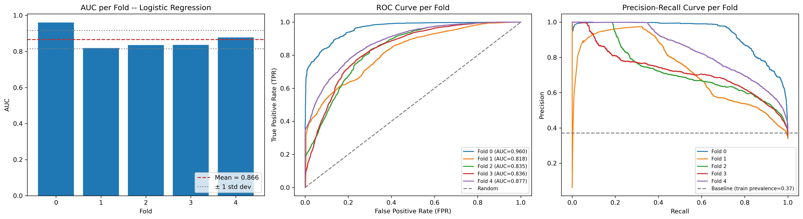
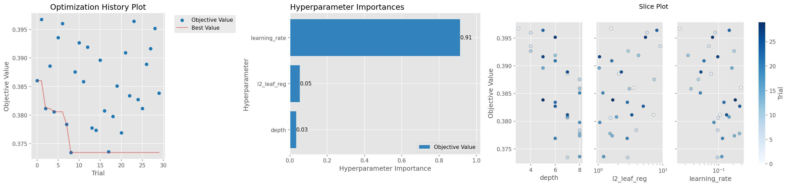

# PROJECT WORK BOOK

Esse documento tem como objetivo registrar todo o passo-a-passo seguido durante a implementação e serve como guia de decisões tomadas e caminhos seguidos de forma completa.

O projeto em questão é para entrega do Midterm Project do curso de Machine Learning promovido pelo DataTalks Club em 2026.

Além da entrega para o curso, esse projeto buscar testar o framework de metodologia de trabalho desenvolvido por mim, onde há desenho de como seguir de forma estruturada um projeto de Data Science. 
- Serão aplicados os passsos referentes a metodologia até o ponto desenvolvido durante as aulas (aula 6).
- Feedbacks desse framework serão computados nesse arquivo para ajuste posterior.
- O framework se encontra no repositório: **data-science-work-methodology**

## 1 - Definição do problema

O primeiro passo da metodologia adota é a criação de um Problem Framing Documentation, onde a ideia é responder as seguintes perguntas antes de tocar de fato nos dados e iniciar a exploração:

    1 - Qual é a decisão de negócio que o modelo vai informar?
    2 - Qual é a unidade de análise?
    3- O target está bem definido e é observável de forma confiável?
    4 - Existe um baseline atual (processo manual, regra de negócio, heurística)?
    5- Qual é o critério de sucesso, travado antes de rodar o primeiro modelo?
    6 - Existe restrição regulatória ou de auditoria que torna explicabilidade formal um requisito, não um nice-to-have?
    7 - Qual é a data de referência e a janela de desempenho do target? 
    8 - O rótulo já maturou pra todas as observações que vão entrar no treino?
    9 - O rótulo depende de uma decisão que o processo atual já tomou sobre aquele caso? 
    10 - Qual a capacidade operacional de resposta, e quanto custa (mesmo grosseiramente) um Falso Positivo e um Falso Negativo? 

Para se manter fiel ao passo a passo dessa metodologia, criou-se o documento **problem-framing-documentation.md**, onde foi estruturado as respostas dessas perguntas seguindo o passo a passo.

## 2 - Coleta dos Dados

Os dados coletados são de uma base sintética no Kaggle. Dessa forma a questão de disponibilidade e verificação não cosnegue ser validada. Aqui separei a estrutura do dataset e colunas.

- **Link:** [Hotel Booking Dataset](https://www.kaggle.com/datasets/jessemostipak/hotel-booking-demand)
- **Total de elementos:** 119.390.
- **Taxa de cancelamento:** 37.0% 


| Coluna                         | Descrição |
|--------------------------------|----------------------------------------------| 
| hotel                          | Tipo do hotel (cidade, resort)
| lead_time                      | Tempo entre reserva chegada
| arrival_date_year              | Ano da chegada
| arrival_date_month             | Mês da chegada
| arrival_date_week_number       | Número da semana da chegada
| arrival_date_day_of_month      | Dia do Mês da chegada
| stays_in_weekend_nights        | Número de dias do final de semana da reserva
| stays_in_week_nights           | Número de dias de semana da reserva
| adults                         | Número de adultos
| children                       | Número de crianças
| babies                         | Número de bebês
| meal                           | Tipo de refeição reservada
| country                        | País de origem
| market_segment                 | Designação de segmento de mercado
| distribution_channel           | Canal de distribuição da reserva
| is_repeated_guest              | É cliente repetido
| previous_cancellations         | Quantidade de reservas canceladas antes
| previous_bookings_not_canceled | Quantidade de reservar não canceladas antes
| reserved_room_type             | Tipo do quarto da reserva
| assigned_room_type             | Tipo do quarto designado no check-in
| booking_changes                | Número de mudanças feitas na reserva
| deposit_type                   | Tipo de depósito
| agent                          | ID da agência de viagem
| company                        | ID da companhia
| days_in_waiting_list           | Dias na lista de espera antes do agendamento
| customer_type                  | Tipo de reserva
| adr                            | Tarifa diária média
| required_car_parking_spaces    | Número de espaços para estacionamento
| total_of_special_requests      | Número de pedidos especias requisitados
| reservation_status             | Último status da reserva
| reservation_status_date        | Data do último status
| is_canceled                    | Target: indica se foi ou não cancelado

# 3. Qualidade e Limpeza de Dados

### 3.1. Checagem Inicial

Fizemos alguns checks iniciais para validar o dataset.

- **Checagem do target:** validação da coluna `is_canceled`:
    - Não possui valores nulos.
    - Não houve mudanças sobre sua definição ao longo do tempo, sendo apenas a informação de cancealamento ou não da reserva.
    - Temos uma proporção entre 1/0 de 37.04% (44.224 eventos positivos).
- **Tipos das colunas:** foi realizado a conferência da tipagem das colunas, sendo necessário 3 mudanças:
    - `agent`: representa as agências de viagem, como é anonimizado por número, estava como numérica -> convertida para str.
    - `company`: representa as companhias/empresas, como é anonimizado por número, estava como numérica -> convertida para str
- **Normalização de colunas:** todas as colunas passaram por normalização textual e todas as colunas str tiveram seus valores normalizados.

### 3.2. Valores duplicados

Ao se verificar o total de valores duplicados, temos 32.252 ocorrências e ao se fazer uma rapida checagem nas taxas de cancelamento entre duplicatas, observou-se:

- Taxa de cancelamento [DF Original] = 0.3704
- Taxa de cancelamento [DF sem Duplicatas] = 0.2728
- Taxa de cancelamento [DF apenas Duplicatas] = 0.6343

Olhando especificamente as colunas `market_segment`, `customer_type`, `deposit_type`, percebeu-se uma concentração elevada em algumas categorias, de forma que tenha relação sistêmica com a anonimação do dataset.

Dessa forma manteve-se  as informações para investigação posterior na sessão 4.

### 3.3. Valores Nulos

Foi avaliado a presença de valores Nulos nas colunas do dataset para tentar entender qual seria a estratégia para cada caso e como resolver. Dessa forma obteve-se 4 colunas:

- `children`: possui 4 nulos (0.003%). Como o percentual é muito baixo, optou-se pela estratégia simples de imputar a Moda do dataset nesses pontos.
- `country`: possui 488 nulos (0.41%). Como é uma informação categórica a respeito do país de onde quem marcou a reserva vem, optou-se por imputar "unknown", trazendo algo sobre essa informação.
- `agent`: possui 16.340 nulos (13.69%). Como isso tem de fato um significado, onde não houve intermédio de agências de viagem, colocou-se "no_agency".
- `company`: possui 112.593 nulos (94.31%). Como isso tem de fato um significado, onde não é uma empresa fazendo a reserva, colocou-se "no_company".

### 3.4. Outliers

Foi verificado a questão de outliers de forma simples utilizando describe(), para trazer pontos fora do esperado para uma investigação mais completa. Nesse primeiro momento houve apenas um ponto de atenção:

`adr`: essa coluna possui informações a respeito de tarifas diárias. No entanto ela aparece com dos pontos de atenção:
    - Valor negativo: aparece -6,38 como valor mínimo.
    - Valor muito alto: aparece 5.400 como valor máximo.

<p align="center">
  
</p>


Ao olharmos o histograma, percebemos que não são valores dentro do esperado. 

O valor negativo se encontra apenas em 1 único evento, sugerindo que pode ter sido algum problema de imputação. O valor de 5.400 aparenta também ser algum tipo de erro de digitação, pelo fato de ser um caso isolado, 10x maior que o 2º maior valor de ~500. Ao removermos esse valor do plot temos algo muito mais factivel.

Dessa forma a estratégia adotada:
- Valor negativo: utilizamos o valor absoluto.
- Valor elevado: capamos em um valor razoável (500).

`adults`: essa coluna informa sobre o total de adultos na reserva. No entanto ela aparece com um ponto de atenção:
    - Valor muito alto: aparece 55 como valor máximo.
    - Valor 0: aparece alguns casos com 0 adultos na reserva.

<p align="center">
  
</p>

Ao olharmos o histograma, percebemos que a concentração de valores está entre 1 e 5, o que de fato faz muito mas sentido. Os valores muito elevados não fazem muito sentido pensando em uma reserva de hotel, sendo que acima de 5 pessoas, temos apenas 14 eventos. Para os valores de 0 pessoas adultas, também é estranho, mesmo que tenhamos um total de 403 linhas.

Dessa forma a estratégia adotada:
- Valor elevado: Os valores de outras informações relativas à valores elevados indicavam algum problema de imputação, de forma que foram removidos.
- Valor 0: foram removidas as linhas com 0 adultos na reserva por incosistência com a realidade. Em um cenário real isso seria bloqueado ou informado para ajuste.

Dentro dessa questão ainda surgiu mais uma verificação, reservas que constam com 0 pessoas (adults + children + babies) sendo 180 eventos no total.

### 3.5. Desbalanceamento da classe

No dataset atual, não há um problema em relação ao balanceamento que precise de tratamento inicialmente. Além de uma taxa de `is_canceled` = 1 de 37%, ainda há um total de eventos relativamente alto em quantidade absoluta, com 44.224 eventos.

### 3.6. Informações descartadas

Ao se fazer uma análise das informações disponíveis no dataset, duas colunas tiveram que ser descartadas:
- `reservation_status` e `reservation_status_date`: elas refletem o real status da reserva e o momento de atualização do último status. No entanto são informações que não estão "disponíveis" no momento da reserva, elas são resultado diretamtente do nosso target `is_canceled`.

# 4. Split no Dataset

Antes de entrarmos de fato da EDA, vamos fazer o split do dataset, pois a nossa fold de Test não pode ser utilizado para nenhum tipo de tomada de decisão, ficando em total isolamento das análises e tomadas de decisão a partir de agora. Dessa forma estudou-se a melhor maneira de fazer o split.

Pensando em um dataset temporal, com reservas monitoradas em um período de 35 meses, a estratégia de OOT ganha um grande valor aqui, com treino no passado para previsões futuras. A questão que gira em torno dessa estratégia é a data de base para os splits, pois há a data de chegada mas não há a data de realização da reserva, de forma que precisaremos obter isso a partir das informações diponiveis.

Como sempre existe a informação de `lead_time` e `arrival_date`, podemos utiliza-las para encontrar a data de realização de reserva, que de fato é a data utilizada para um split temporal nesse dataset. Dessa forma podemos avaliar a taxa de cancelamento pela data do booking:

<p align="center">
  
</p>

Percebemos que há um problema em utilizar isso diretamente. O fato da coleta dos dados não ter utilizado a data de booking como parâmetro de corte gera uma distorção quando observamos as datas. Antes de 2015 temos casos esporádicos de reservas sendo realizadas, com um pico estranho em Out/24. Ao observarmos a taxa de cancelamento dessas reservas em relação ao resto do dataset temos:
- **Taxa de cancelamento (antes de 2015)**: 90.16% [2623 eventos].
- **Taxa de cancelamento (pós 2015):** 35.87%.

Dessa forma, optou-se pela remoção das reservas antes de 2015 para evitar a distorção gerada por essa coleta indevida, uma vez que esses eventos só entraram no dataset por terem um lead_time muito elevado, causando essa distorção de 90% de cancelamnto.

Além disso, uma das questões apontadas anteriormente foi a quatidade de duplicatas do dataset. No entanto, uma vez que a verificação de duplicatas foi realizada sem utilizar um subset específico, as datas e lead_time que resultam `booking_date` são sempre iguais, fazendo que cortes temporais no dataset sempre garantam que as duplicatas caiam no mesmo fold, evitando vazamento por duplicatas.

<p align="center">
  
</p>

Outro ponto de atenção que foi observado é a questão da ponta direita do dataset (`booking_date` mais recente) para validar a questão se não há um problema de viés de `lead_time` muito baixo, ou seja, uma taxa de cancelamento menor nesses casos. Já foi perceptivel no gráfico anterior uma tendência de queda, e quando damos um zoom-in claramente temos um valor muito inferior na ponta direita.

Com isso definiu-se um range para o dataset fechado para remoção dos ruídos: `2015-01-01` até `2017-06-30`, com uma distribuição dada por:

<p align="center">
  
</p>

## 4.1. OOT

Após todas as considerações é necessário aplicar de fato a técnica de Out of Time no dataet, onde iremos separar um parte dos dados mais recentes com o dataste de Teste, enquanto o restante se torna o dataset de treino/validação, onde iremos rodar Cross-Validation utilizando recortes temporais.

- **cutoff entre Treino / Teste =** `2017-01-01`

- **Treino:**
    - data ínicio = `2015-01-01`.
    - data final = `2016-12-31`.
    - tamanho dataset = 89.858 eventos.
    - percentual da base = 78.63%.
    - taxa de cancelamento = 37.11%

- **Teste:**
    - data ínicio = `2017-01-01`.
    - data final = `2017-06-30`.
    - tamanho dataset = 24.427 eventos.
    - percentual da base = 21.37%.
    - taxa de cancelamento = 32.41%

> *PS: ainda percebe-se uma taxa menor de cancelamento no dataset de teste pelo que verificamos anteriormente, em que temos uma viés de diminuição de taxa ao avançarmos para direita no dataset devido à distorção gerada pela forma de coleta, no entanto conseguimos diminuir para valores aceitáveis.*

## 4.2. TimeSeriesSplit x Unique Validation 

Uma vez que selecionamos a fatia de teste anteriormente utilizando OOT, vamos manter a estratégia de divisão temporal no dataset. Uma das mais interessantes aqui é TimeSeriesSplit, que consiste em uma divisão de folds utilizando uma data de referência para dividirmos o dataset.

Os pontos que devemos tomar cuidado ao utilizar essa estratégia e os prós/contras são explicitados a seguir:

  - **a) Comparação entre modelos:** como será necessário fazer comparações entre modelos para uma escolha futura, vai ser necessário multíplos folds pareados, para garantir uma força estatística de comparação adequada, eliminando viés ou erros estatísticos e dessa forma uma separação múltiplica com folds temporais ganha bastante valor.
  
  - **b) Tamanho da amostra:** ao utilizarmos esse tipo de estratégia é necessário garantir que a amostra seja robusta o suficiente. No cenário atual temos 24 meses de análise (split OOT) com 89.858 eventos, o que parece suportar uma divisão dessa forma sem o risco de micro folds ou coisas do gênero. Se por exemplo tivermos 5 splits, teremos pelo menos 4 meses em cada um.
  
  - **c) Custo computacional:** um cuidado que é necessário no entanto é o gasto computacional que o tuning futuro ao se utilizar essa estratégia vai gerar. Como temos em torno de 90 mil linha, isso acaba não se tornando um problema muito alarmante, mas é necessário monitorar esse tipo de prática.

  - **d) Expanding window x Sliding window:** existem duas estratégias dentro do TimeSeriesSplit, onde a primeira utilizamos folds cumulativos, ou seja, o fold seguinte (mais ao futuro) agrega os dados do fold anterior, fazendo com que os dados mais do passado também treinem esse fold. Ou temos a segunda, onde cada fold recorta uma janela de tempo fixo, e conforme o fold avança para frente, os do passado não são utilizados. Como não temos um problema de mudança de comportamento do target ou booking, e nossa janela de tempo não é tão elevada, vamos adotar a estratégia inicial de folds cumulativos.

# 5. Exploratory Data Analysis (EDA)

Agora iremos começar a olhar os dados de fato. No entanto devemos fazer qualquer tipo de exploração sem nunca olhar dataset de teste, pois isso pode causar vazamentos ou coisas do gerêrno, assim, vamos focar no dataset de treino.

## 5.1. AUC Univariado

O primeiro teste simples é observar se as features individualmente já possuem algum tipo de informação do target (e também verificar se não há vazamento por alguma se o valor der muito alto). Dessa forma aplicou-se o teste obteve-se algumas resultados que fazem sentido quando pensamos na reserva de fato, podendo-se destacar:

- `lead_time`: algo que já tinhamos percebido antes, mas vemos aqui novamente que reservas com muita antecedência tendem a cancelar mais.

- `total_of_special_requests`: essa é uma feature que nos traz um certo "engajamento", então de fato espera-se que quanto mais pedidos e personalização de uma reserva tenhamos, menor a chance de cancelamento.

- `booking_changes`: também uma feature de "engajamento", mostrando uma taxa de reserva menor para muitas mudanças.

- `previous_cancellations`: essa também faz sentido, pois indica que o hóspede já tem um certo "costume" de cancelar reservas, então de fato espera-se uma maior taxa de cancealementos em hóspedes recorrentes a cancelar.

- `arrival_date_year`: essa é uma feature que relaciona com data, temos que tomar cuidado aqui, ainda mais que no dataset só possuimos duas opções (2015/2016), então o sinal que obtivemos aqui talvez não faça tanto sentido de ser utilizado.

## 5.2. IV para Variáveis Categóricas

A mesma ideia anterior foi aplicada nas variáveis categóricas, mas dessa vez utilizadno o conceito de Information Value, que busca responder a mesma pergunta, uma variavel categórica isolada tem algum poder preditivo?

Ao rodarmos o teste, algumas features chamaram atenção:

- `deposit_type`: trouxe um valor elevadíssimo (acima 0.5 já seria suspeito), o que demandou uma investigação mais aprofundada.
  - Ao observarmos de fato as opções, verificamos que `deposit_type` = no_refund possui 99.28% de taxa de cancelamento.
  - No entanto essa informaão de fato é disponível no momento da reserva, então não é um vazamento propriamente dito.
  - Quando comparamos isso com as duplicatas verificadas antes, que possuiam boa parte (~40%) como no_refund, começamos a perceber um padrão sistemático, onde reservas de bloco, via agência com depósito não-reembolsável tem uma cancelamento elevado.
  - Dessa forma manteremos a feature como uma forte preditora.

- `assigned_room_type`: essa feature chama atenção pelo fato de quando olhamos `reserved_room_type`, temos um valor bem inferior e isso levantou a suspeita de que a feature de quarto designado não esteja disponivel no momento da reserva e seja atribuido posteriormente, não podendo ser utilizada pelo modelo que tem como objetivo avalair as reservar no momento do agendamento.
  - Aqui temos uma diferença de 5.4% x 40.6% entre taxas de cancelamentos para quarto diferente x quarto igual respectivamente. Isso claramente é uma diferença alta e faz sentido com a hipótese de vazamento de processo, pois apenas quando o hóspede chega ao hotel que há uma troca de quarto (ou pelo menos muito próximo da viagem). 
  - Dessa forma o fato de o cliente chegar ao hotel para a hospedagem implica na mudança possível de quarto, logo a chance de ele cancelar nesse momento é muito menor.
  - Assim, iremos remover essa feature especificamente pois ela não está disponível no momento da reserva e carrega um vazamento de processo.

- `agent`: essa feature também temos que tomar cuidado pois ela apresenta um sinal relativamente alto, mas o fato de possuir muitas categorias (304) pode ter levado a inflada do valor do sinal.

## 5.3. Taxa por Decil

Vamos avaliar o tipo de relação entre as features analisadas na sessão anterior, dessa forma vamos utilizar a separação em agrupamentos. Para os casos que temos bastante opções em variáveis contínuas, aplicamos o corte por decil. Para os casos que tem poucas opções, podem avaliar pela opções diretamente.

A seleção de quais features testar deixou de ser manual: a partir daqui usamos a `lista_features`, e o critério de decil vs. valor bruto também é automático, baseado na cardinalidade de cada feature (`decile_cardinality_threshold = 20`, corte por julgamento, mesma categoria do `auc_power`/`iv_power`).

- `lead_time`: Decil Cut.
  - Percebemos uma relação monotônica bem direta, a taxa de cancelamento sobe junto com a subida de `lead_time`.

- `adr`: Decil Cut.
  - Há uma relação mais serrilhada, não se mantendo constante em uma única direção.

- `total_of_special_requests`: Normal Cut.
  - Uma relação inversa, indo em direção do que era previsto para um cliente mais engajado tender a cancelar menos.

- `booking_changes`: Normal Cut.
  - Também segue a relação inversa devido ao engajamento do clientes, só tem uma distorção conforme aumentamos muito, mas poquissimos casos.

- `previous_cancellations`: Normal Cut.
  - Chama atenção o fato de um cancelamento prévio ter 94% de chance de cancelamento da reserva. 
  - Ao cruzarmos com algumas outras informações, não parece ter algum tipo de problema.

- `required_car_parking_spaces`: Normal Cut.
  - Também chama atenção o fato de 1+ vaga requisitada ter 0% de taxa de cancelamento (com mais de 5000 eventos).
  - Foi feita uma investigação para verificar vazamento, porém aparentemente não isso acontecendo.
  - Dessa forma mantemos ela, mas com um ponto de atenção.

- `arrival_date_year`: Normal Cut.
  - Relação crescente forte entre os anos (29,8% em 2015 → 52,0% em 2017).
  - Ponto de atenção: essa relação provavelmente não generaliza bem — "ano" é uma feature que, em produção, sempre vai apresentar valores que o modelo nunca viu no treino (2018, 2019...). Pode também estar parcialmente confundida com `lead_time` (reservas mirando anos mais distantes tendem a ter antecedência maior).

- `arrival_date_week_number`: Decil Cut.
  - Relação fraca e sem tendência clara, oscilando entre ~32% e ~45% sem padrão monotônico. Não parece carregar sinal forte isolado, apesar de ter passado no corte de seleção.

- `adults`: Normal Cut.
  - Relação não perfeitamente monotônica (1→30,2%, 2→39,1%, 3→32,8%, 4→23,9%). O valor 4 tem amostra pequena (46 casos) — tratar com cautela.

- `days_in_waiting_list`: Decil Cut.
  - O corte por decil não capturou a relação real, pois a variável é extremamente concentrada em 0 (96% das linhas). Recodificada como binária (was_on_waiting_list), revela sinal forte e intuitivo: 63,9% de cancelamento entre quem passou por lista de espera, vs. 36,0% no restante. Considerar essa binarização como opção de feature engineering na Seção 5, em vez do valor contínuo bruto.

- `stays_in_week_nights`: Decil Cut.
  - Relação fraca, sem tendência monotônica clara — leve pico entre 1-2 noites (44,2%), depois se estabiliza por volta de 35-38% nas faixas seguintes.
  
## 5.4. Estabilidade Temporal

Avaliamos a estabilidade da relação entre cada feature selecionada e o target ao longo dos 24 meses do Treino, comparando o poder (AUC/IV) mensal contra a referência calculada no Treino inteiro.

**Estáveis (numéricas)**: `lead_time`, `adr`, `total_of_special_requests`, `required_car_parking_spaces`: oscilação normal em torno da referência, sem tendência ou queda abrupta.

**IV mensal instável (categóricas) - artefato de amostra pequena, não instabilidade real**:
`deposit_type`, `country`, `market_segment`, `hotel` (e demais categóricas) mostraram IV mensal oscilando muito acima da referência do Treino inteiro, inclusive em features de baixa cardinalidade (`hotel` tem só 2 categorias). Investigamos isolando `deposit_type=non_refund` e olhando a taxa de cancelamento bruta mês a mês (que não sofre desse viés) - o resultado ficou estável entre 91,6% e 100% em todos os 24 meses, com volume relevante. Conclusão: o IV calculado em amostra pequena (~3-9k linhas/mês vs. ~90k do Treino inteiro) infla sistematicamente por propriedade do próprio estimador - não usamos o gráfico de IV mensal pra julgar estabilidade individual das demais categóricas.

**`agent` - instabilidade parcialmente real, não só artefato**:
Ao investigar os 5 agentes de maior volume com taxa bruta mensal: `agent=9.0` mostra tendência real de alta ao longo de 2016 (20%→48%); `agent=1.0` mostra concentração extrema de volume em 2015 (pico de 2.552 reservas em jul/2015) e quase desaparecimento em 2016 - padrão parecido com o achado de `previous_cancellations`, mas testado e confirmado como **não sendo o mesmo conjunto de linhas** (só 11,8% de sobreposição). `agent=240.0` razoavelmente estável; `no_agency` e `agent=6.0` ruidosos sem tendência clara (provável amostra pequena). Conclusão: diferente do `deposit_type`, `agent` carrega heterogeneidade temporal real em pelo menos dois dos seus valores mais frequentes - vale atenção redobrada se essa feature entrar como está (alta cardinalidade) na Seção 5.

**`previous_cancellations` - instabilidade real, feature candidata a reavaliação**:
O poder (AUC) despenca de ~1,0 (jan-mar/2015) pra 0,50 (abr-ago/2015), sobe de novo (set-nov/2015) e praticamente desaparece (fica em 0,50) durante quase todo 2016. Investigando o volume de `previous_cancellations=1` por mês, o padrão se confirma: concentração forte em blocos de 2015 (jan-mar e set-dez, centenas por mês) e quase ausência em 2016 (dezenas por mês). Como 2016 é o período mais próximo do Teste (2017), o sinal agregado (poder=0,55) é dominado por um padrão de 2015 que pode não se repetir - candidata a reavaliação/remoção na Seção 5, ou uso com monitoramento reforçado.

### 5.5. Validação Adversarial

Treinamos um classificador (RandomForestClassifier) para distinguir linhas de 2015 vs. 2016 dentro do Treino, usando as features numéricas selecionadas (excluindo `arrival_date_year`/`arrival_date_week_number`, que encodam o calendário diretamente e inflam o resultado de forma trivial).

**AUC adversarial = 0,6806** - indica diferença de composição moderada (não um abismo) entre os dois períodos.

**Features mais responsáveis pela separação**: `previous_cancellations` (0,292) e `days_in_waiting_list` (0,266), somando mais da metade da importância total. Ambas investigadas individualmente e confirmadas com o mesmo padrão: concentração forte de meados de 2015 a início de 2016, seguida de quase desaparecimento pelo resto de 2016. `adr` (0,205) e `lead_time` (0,139) também aparecem, mas com explicação mais plausível e menos preocupante (reajuste natural de tarifa ao longo do tempo; ligação já conhecida de `lead_time` com o viés de coleta tratado na Seção 6).

**Observação agregada**: três sinais independentes (`previous_cancellations`, `days_in_waiting_list`, e o comportamento de `agent=1.0`) compartilham a mesma assinatura temporal - presença forte num bloco entre meados de 2015 e início de 2016, quase ausência depois. Isso sugere uma causa comum não identificada (possível mudança operacional/de canal por volta de 2016), não três fenômenos isolados. Registrado como limitação conhecida: essas features carregam risco de não generalizar bem para o período de Teste (2017) e para produção futura.

### 5.5. Correlação entre Features (Spearman) e Multicolinearidade (VIF)

Diferente das etapas anteriores (que avaliaram feature vs. target), aqui avaliamos a relação **entre as próprias features numéricas** — informação nova que ainda não tínhamos.

Optamos por Spearman em vez de Pearson por já termos visto relações não-lineares em alguma features (ex: `adr`), tornando a correlação por rank mais segura como default.

**Achados da correlação**:
- `arrival_date_year` × `lead_time` = 0,34 — confirma a suspeita levantada lá na Seção 5.1 de que parte do sinal de `arrival_date_year` vem emprestado do `lead_time`.
- `arrival_date_year` × `arrival_date_week_number` = -0,52 — correlação forte, provavelmente reforçada artificialmente pelo recorte temporal fixo do Treino (jan/2015-dez/2016) definido na Seção 6.

**Achados do VIF**:
- `arrival_date_year` (23,1) e `arrival_date_week_number` (5,3) — redundantes entre si, consistente com a correlação acima.
- `adults` (18,9) — chamativo porque nenhuma correlação par-a-par com `adults` passa de 0,27. O VIF captura redundância **multivariada**: a combinação de `adr` + `lead_time` + `stays_in_week_nights` + `total_of_special_requests` explica boa parte da variância de `adults`, sem que nenhuma isoladamente pareça redundante.

**Decisão**: multicolinearidade é problema de inferência (coeficiente instável em modelo linear), não de predição — para GBM (modelo mais provável dado o restante do projeto), VIF alto não exige ação por si só. `adults` fica como está, sem necessidade de exclusão.

`arrival_date_year`, porém, acumula três evidências independentes contra seu uso como feature bruta: (1) não generaliza bem — produção sempre trará anos fora do que o Treino viu; (2) contribuiu para o AUC adversarial inflado (Seção 5.4), ao encodar calendário diretamente; (3) VIF alto (23,1), reforçando a redundância com `lead_time`. **Decisão preliminar para a Seção 6 (seleção de features): excluir `arrival_date_year` como feature bruta**, mantendo `lead_time` como portador da informação temporal relevante de forma mais robusta.

### 5.6. Associação entre Features Categóricas (Cramér's V)

Equivalente categórico da análise de correlação/VIF do 4.1 - avalia redundância entre as próprias features, não feature vs. target.

**Correção de método (rodada 2)**: a primeira versão excluía `agent`, `country` e `company` do teste por suspeita de inflação do V em alta cardinalidade. Em vez de excluir, aplicamos a correção formal (Cohen, 1988): o limiar de "associação grande" não é fixo - encolhe com o grau de liberdade (`limiar_grande = 0,5/√df`, `df = min(categorias_1 - 1, categorias_2 - 1)`). Isso expôs um problema (`country` × `company` = 0,077 passava como "grande" só por ter `df` enorme - 165 - tornando qualquer V acima de ~0,04 "estatisticamente grande", mesmo sendo desprezível na escala natural). Corrigido com **dois filtros simultâneos**: o limiar ajustado por `df` (estatístico) **e** um piso fixo de 0,5 (prático, independente de `df`), exigindo os dois para marcar redundância real.

**Achados confirmados (passam nos dois filtros)**:
- `reserved_room_type` × `assigned_room_type` (0,725): esperado, irrelevante para decisão - `assigned_room_type` já excluído por vazamento de processo (Seção 5.1).
- `market_segment` × `distribution_channel` (0,683): redundância real. `market_segment` tem IV bem maior (0,276 vs. 0,130), sugerindo que carrega a maior parte da informação de forma mais granular.
- `meal` × `agent` (0,508): irrelevante para decisão - `meal` já excluído pelo corte de IV (Seção 5.1.1, IV=0,0148 < 0,02).
- `hotel` × `agent` (0,880), `distribution_channel` × `agent` (0,715), `market_segment` × `agent` (0,635), `market_segment` × `company` (0,546): `agent`/`company` resumem parcialmente informação de features mais agregadas (um agente tende a concentrar hotel/canal/segmento específicos) - faz sentido de negócio, não indica erro. Reforça (mas não é a única evidência de) a decisão de remover `distribution_channel`: ele é redundante tanto com `market_segment` quanto com `agent`.

**Nota perdida na primeira versão, mas que ainda vale**: `deposit_type` × `market_segment` (0,362) também passa como redundância "grande" pelo limiar ajustado - confirma formalmente a hipótese já levantada nas investigações de duplicatas/`adults>5` (`non_refund` concentrado em segmentos específicos de mercado). Não passa no piso prático de 0,5, então fica como achado qualitativo confirmado, não como redundância "forte" pelos dois critérios.

**Decisão**: sem ação forçada para a maioria - para GBM, associação entre categóricas não compromete predição, só parcimônia. `agent`/`company` mantidos apesar da redundância parcial, pois carregam sinal próprio (segundo e oitavo maior IV da tabela) em granularidade mais fina que as features agregadas - redundância parcial não é informação idêntica. `distribution_channel` confirmado para remoção (Seção 6), agora com duas fontes independentes de redundância (`market_segment` e `agent`), não apenas uma.

### 5.7. Lista Final de Features (Consolidação)

Lista final obtida aplicando, sobre `lista_features` (corte estatístico AUC≥0,52/IV≥0,02, Seção 5.1.1), as exclusões de julgamento acumuladas ao longo da Seção 5:

```python
drop_columns = {
    "assigned_room_type": "process leakage (Section 5.1.1) -- only exists after check-in",
    "arrival_date_year": "does not generalize (future years never seen in train) + contributed to inflated adversarial AUC (Section 5.4) + VIF=23.1 (Section 5.5)",
    "distribution_channel": "redundant with market_segment (Cramér's V=0.683, Section 5.6) -- market_segment has greater IV (0.276 vs 0.130)",
}
```

**Numéricas finais (10)**: `lead_time`, `total_of_special_requests`, `booking_changes`, `previous_cancellations`, `required_car_parking_spaces`, `adr`, `arrival_date_week_number`, `adults`, `days_in_waiting_list`, `stays_in_week_nights`

**Categóricas finais (9)**: `deposit_type`, `agent`, `country`, `market_segment`, `customer_type`, `company`, `hotel`, `reserved_room_type`, `arrival_date_month`

**Pendências de feature engineering para a Seção 7 (não são exclusões, são transformações já decididas)**:
- `days_in_waiting_list` → recodificar como binária (`was_on_waiting_list`), decil não captura a relação (Seção 5.2).
- `booking_changes` → agrupar valores ≥6 (amostra muito pequena e instável por valor individual, Seção 5.2).
- `previous_cancellations` → agrupar valores ≥2; considerar ainda a instabilidade temporal confirmada (Seção 5.4 — concentração em blocos de 2015, quase ausência em 2016) antes de decidir se entra como está ou com ressalva de monitoramento.
- `agent`, `company` (alta cardinalidade, 304/303 categorias) → encoding nativo do GBM ou `TargetEncoder` com cross-fitting na Seção 7; nunca one-hot.
- `deposit_type` → atenção à calibração (Seção 8.3), dado o padrão de quase-separação perfeita em `non_refund` (IV=2,04).
- `required_car_parking_spaces` → atenção à calibração (Seção 8.3), dado o padrão de 0% de cancelamento cravado no subgrupo investigado.

## 6. Modelagem

### 6.1. Modelo Base (Regressão Logística)

Regressão Logística como baseline de comparação (Seção 8.4 do playbook - comparar só contra `DummyClassifier` é pouco informativo, já que AUC=0,5 por construção; o baseline que importa é regra de negócio atual e/ou modelo linear simples).

**Pipeline**: `StandardScaler` nas numéricas (necessário para Regressão Logística, já que a regularização L2 padrão do sklearn depende da escala - Seção 5.4) + `OneHotEncoder(min_frequency=0.01, handle_unknown="infrequent_if_exist")` nas categóricas (agrupa automaticamente categorias raras de `agent`/`country`/`company` numa coluna `infrequent`, em vez de explodir dimensionalidade - reduziu `agent` de 304 categorias para 15 colunas geradas).

**Avaliação**: `cross_validate` com `TimeSeriesSplit(n_splits=5)` (mesmo CV decidido na Seção 4.2), métricas sem dependência de limiar (`roc_auc`, `average_precision`, `neg_log_loss` - F1 evitado de propósito, por misturar qualidade do modelo com escolha de limiar, que só é decidida na Seção 11).

**Resultado (AUC por fold)**: `[0.960, 0.818, 0.835, 0.836, 0.877]` - média 0,8655, desvio-padrão 0,0511.

**Investigação do Fold 0 (anômalo)**: AUC de 0,960 contra 0,82-0,88 nos demais. Investigado cruzando a composição do fold de validação (set-dez/2015) com as três features mais fortes e mais suspeitas de instabilidade temporal (Seção 5.3/5.4):

| | Fold 0 | Demais folds |
|---|---|---|
| `previous_cancellations==1` | 15,3% | 0,2-0,4% |
| `days_in_waiting_list>0` | 11,5% | 0,2-2,6% |
| `deposit_type=non_refund` | 19,4% | 2,5-13,8% |

Confirma a hipótese: o Fold 0 concentra muito mais casos de sinal quase-determinístico (ambas as features citadas têm taxa de cancelamento >90% em sua categoria/valor extremo) do que os demais - o problema fica artificialmente mais fácil nesse recorte específico do tempo, não é capacidade superior do modelo.

**Decisão de leitura**: a média simples (0,8655) deve ser lida com ressalva - está inflada pelo Fold 0. O desempenho esperado em produção está mais próximo da faixa dos Folds 1-4 (0,82-0,88). Reportar sempre a distribuição completa por fold (ou ao menos média + desvio-padrão), nunca só a média isolada, para esse e para os próximos modelos comparados.

<p align="center">
  
</p>

### 6.2. Comparação de Modelos Base (sem tuning)

Quatro modelos avaliados com `TimeSeriesSplit(n_splits=5)` (janela crescente), mesmos folds para todos (comparação justa): Regressão Logística (baseline, Seção 6.1), XGBoost, LightGBM e CatBoost - sem tuning de hiperparâmetro nesta etapa, só para ter um primeiro comparativo entre famílias.

SVM, KNN e MLP foram descartados como candidatos (sem testar): SVM tem custo computacional proibitivo no volume de dado (~90k linhas) e não gera probabilidade bem calibrada nativamente; KNN sofre da alta cardinalidade de `agent`/`country`/`company` e da maldição da dimensionalidade; MLP tem evidência desfavorável frente a GBM em dado tabular (Grinsztajn et al., 2022, citado no playbook).

**Pipeline dos GBMs**: classe customizada (`GBMCategoricalPreparer`) para lidar com categoria nova em produção/validação - aprende as categorias só no Treino de cada fold e converte categoria não vista em `NaN` (XGBoost/LightGBM, que aceitam nativamente) ou na string `"unseen"` (CatBoost, que exige string em vez de `NaN` em categórica).

**Resultado (AUC por fold)**:

| Modelo | Fold 0 | Fold 1 | Fold 2 | Fold 3 | Fold 4 | Média | Desvio |
|---|---|---|---|---|---|---|---|
| Logistic Regression | 0,960 | 0,819 | 0,836 | 0,836 | 0,877 | 0,8655 | 0,0511 |
| XGBoost | 0,957 | 0,861 | 0,858 | 0,848 | 0,911 | 0,8870 | 0,0413 |
| LightGBM | 0,963 | 0,877 | 0,862 | 0,863 | 0,915 | 0,8959 | 0,0385 |
| CatBoost | 0,960 | 0,892 | 0,872 | 0,863 | 0,916 | **0,9005** | **0,0348** |

Todos os quatro mostram o mesmo pico no Fold 0, já diagnosticado e documentado na Seção 6.1 (concentração anômala de `previous_cancellations=1` e `days_in_waiting_list>0` naquele período de validação) - confirma que é característica do dado, não do modelo.

**Leitura preliminar**: CatBoost tem a maior média e o menor desvio entre os 3 GBMs, com XGBoost e LightGBM próximos entre si. A diferença entre os três é pequena o suficiente para exigir teste formal (Nadeau-Bengio/ROPE) antes de declarar um vencedor. Regressão Logística, como esperado, fica atrás dos GBMs em todos os folds, confirmando que a relação entre features e target tem componente não-linear relevante (consistente com achados da Seção 5, ex: `adr` não-monotônico, interações sugeridas por `deposit_type`×`market_segment`).

### 6.3. Teste Formal de Comparação (Nadeau-Bengio)

Objetivo: confirmar se a vantagem aparente do CatBoost na comparação bruta (Seção 6.2) é estatisticamente defensável, ou se está dentro do ruído esperado entre os 5 folds - seguindo a heurística corrigida da Seção 9 do playbook (comparar a dispersão da diferença pareada por fold, não a dispersão de cada modelo isolado).

**Adaptação necessária**: a correção de Nadeau-Bengio (`var × (1/k + n_teste/n_treino)`) assume treino/teste de tamanho estável entre folds (K-Fold clássico). Como o CV usado aqui é `TimeSeriesSplit` com janela crescente (treino cresce a cada fold), usamos a média do tamanho de treino/teste entre os 5 folds como aproximação prática - documentado como simplificação, não como aplicação exata da fórmula original.

**Resultado (comparações pareadas, AUC)**:

| Comparação | Diferença média | t | p-valor |
|---|---|---|---|
| CatBoost vs. LightGBM | +0,0046 | 0,809 | 0,4641 |
| CatBoost vs. XGBoost | +0,0135 | 1,624 | 0,1797 |
| LightGBM vs. XGBoost | +0,0089 | 1,978 | 0,1190 |

**Conclusão**: nenhuma diferença é estatisticamente significativa (todos os p-valores > 0,11). Os três GBMs têm performance estatisticamente equivalente neste dataset - consistente com a literatura citada no playbook (Seção 7.1, Grinsztajn et al.) de que implementações de GBM bem configuradas tendem a convergir em performance tabular. A vantagem do CatBoost na média bruta não é comprovadamente real, é dentro do ruído esperado entre 5 folds.

**Decisão**: seguir com **CatBoost** para a Seção 7 (tuning de hiperparâmetro), não por vitória estatística comprovada, mas por critérios práticos de desempate: menor desvio entre folds (0,0348, mais estável) e encoding nativo de categórica mais sofisticado (*ordered target statistics*, Seção 5.3) - relevante dado que `agent`/`country`/`company` têm sinal real confirmado (Seção 5.1) e cardinalidade alta.

## 7. Tuning de Hiperparâmetros (CatBoost)

Após a comparação entre XGBoost, LightGBM e CatBoost (Seção 6), CatBoost foi escolhido para seguir adiante: não por diferença estatisticamente significativa (ver teste de Nadeau-Bengio, Seção 6.3), mas por ter a menor variância entre folds e o encoding categórico nativo mais sofisticado, relevante para `agent`/`country`/`company`.

Utilizamos Optuna com TPE sampler, 30 trials, otimizando **log loss médio** (não AUC) - métrica sem dependência de limiar, consistente com a recomendação do playbook (Seção 10)
de não usar métricas que embutem decisão de corte durante o tuning. CV: mesmo `TimeSeriesSplit(n_splits=5)` usado na comparação de modelos (Seção 6), garantindo que o tuning seja avaliado na mesma estrutura temporal do resto do projeto.

**Espaço de busca:**
- `learning_rate`: 0.01–0.3 (escala log)
- `depth`: 3–8
- `l2_leaf_reg`: 1.0–10.0 (escala log)
- `iterations`: 1000, com `early_stopping_rounds=50`

**Resultado:** melhor trial (#8 de 30) — log loss médio = **0,3734**

<p align="center">
  
</p>

| Hiperparâmetro | Valor |
|---|---|
| learning_rate | 0,0943 |
| depth | 7 |
| l2_leaf_reg | 2,856 |

**Observações:**
- O ótimo não caiu na borda do espaço de busca (nem learning_rate próximo de 0,01/0,3, nem depth em 3 ou 8 isoladamente dominando), os melhores trials convergiram numa faixa de
  depth 7-8 e learning_rate ~0,09-0,27. Isso sugere que o espaço definido era adequado. Não há indício de que expandir os limites traria ganho.
- `plot_param_importances` e `plot_slice` gerados e salvos em `images/section_08_graph_optuna_resultados_catboost_tuning.png` para referência visual.
- Estudo completo do Optuna (todos os 30 trials, utilizável para reanálise sem rerodar) persistido em `artifacts/optuna/optuna_study_catboost_v1.pkl`.

A célula de tuning mantida no notebook, porém comentada, os hiperparâmetros vencedores foram hardcoded numa célula separada (`best_params`), para evitar re-executar uma busca de ~1h a cada vez que o notebook roda do zero. Reabrir o tuning só se houver mudança relevante no espaço de features, na métrica de otimização, ou na estratégia de CV.

