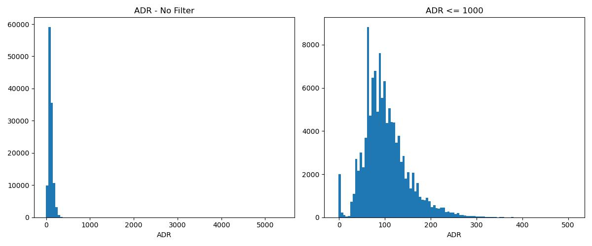
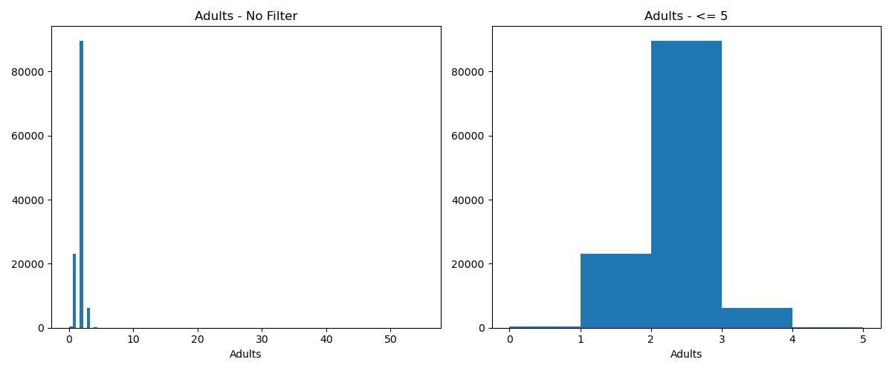
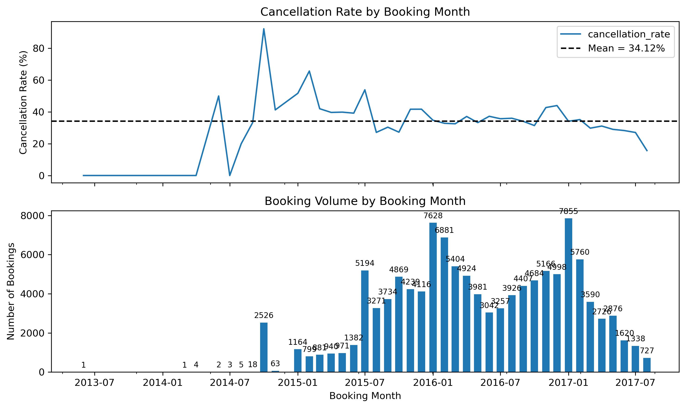
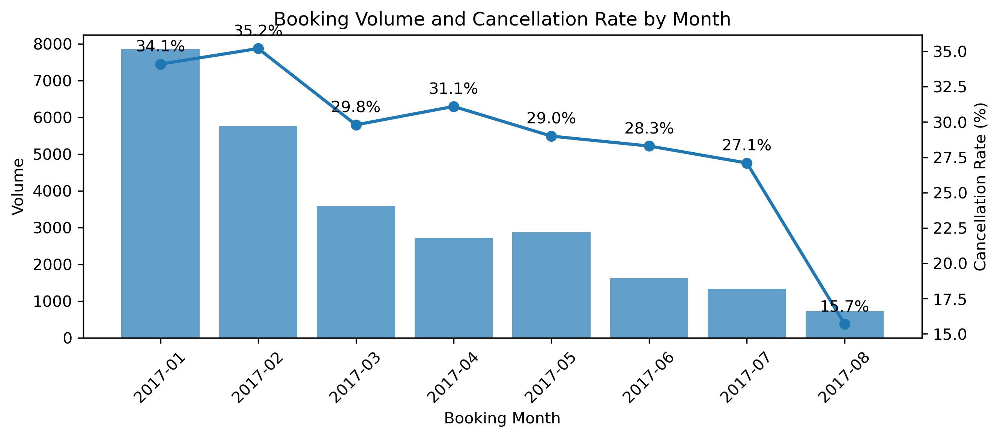
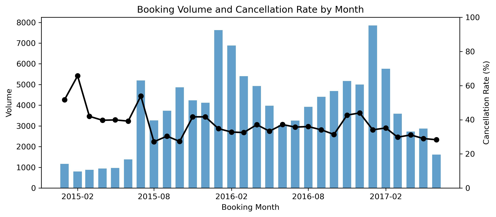

# PROJECT WORK BOOK

Esse documento tem como objetivo registrar todo o passo-a-passo seguido durante a implementação e serve como guia de decisões tomadas e caminhos seguidos de forma completa.

O projeto em questão é para entrega do Midterm Project do curso de Machine Learning promovido pelo DataTalks Club em 2026.

Além da entrega para o curso, esse projeto buscar testar o framework de metodologia de trabalho desenvolvido por mim, onde há desenho de como seguir de forma estruturada um projeto de Data Science. 
- Serão aplicados os passsos referentes a metodologia até o ponto desenvolvido durante as aulas (aula 6).
- Feedbacks desse framework serão computados nesse arquivo para ajuste posterior.
- O framework se encontra no repositório: **data-science-work-methodology**

## 1 - Definição do problema

O primeiro passo da metodologia adota é a criação de um Problem Framing Documentation, onde a ideia é responder as seguintes perguntas antes de tocar de fato nos dados e iniciar a exploração:

    1 - Qual é a decisão de negócio que o modelo vai informar?
    2 - Qual é a unidade de análise?
    3- O target está bem definido e é observável de forma confiável?
    4 - Existe um baseline atual (processo manual, regra de negócio, heurística)?
    5- Qual é o critério de sucesso, travado antes de rodar o primeiro modelo?
    6 - Existe restrição regulatória ou de auditoria que torna explicabilidade formal um requisito, não um nice-to-have?
    7 - Qual é a data de referência e a janela de desempenho do target? 
    8 - O rótulo já maturou pra todas as observações que vão entrar no treino?
    9 - O rótulo depende de uma decisão que o processo atual já tomou sobre aquele caso? 
    10 - Qual a capacidade operacional de resposta, e quanto custa (mesmo grosseiramente) um Falso Positivo e um Falso Negativo? 

Para se manter fiel ao passo a passo dessa metodologia, criou-se o documento **problem-framing-documentation.md**, onde foi estruturado as respostas dessas perguntas seguindo o passo a passo.

## 2 - Coleta dos Dados

Os dados coletados são de uma base sintética no Kaggle. Dessa forma a questão de disponibilidade e verificação não cosnegue ser validada. Aqui separei a estrutura do dataset e colunas.

- **Link:** [Hotel Booking Dataset](https://www.kaggle.com/datasets/jessemostipak/hotel-booking-demand)
- **Total de elementos:** 119.390.
- **Taxa de cancelamento:** 37.0% 

| Coluna                         | Descrição |
|--------------------------------|----------------------------------------------| 
| hotel                          | Tipo do hotel (cidade, resort)
| lead_time                      | Tempo entre reserva chegada
| arrival_date_year              | Ano da chegada
| arrival_date_month             | Mês da chegada
| arrival_date_week_number       | Número da semana da chegada
| arrival_date_day_of_month      | Dia do Mês da chegada
| stays_in_weekend_nights        | Número de dias do final de semana da reserva
| stays_in_week_nights           | Número de dias de semana da reserva
| adults                         | Número de adultos
| children                       | Número de crianças
| babies                         | Número de bebês
| meal                           | Tipo de refeição reservada
| country                        | País de origem
| market_segment                 | Designação de segmento de mercado
| distribution_channel           | Canal de distribuição da reserva
| is_repeated_guest              | É cliente repetido
| previous_cancellations         | Quantidade de reservas canceladas antes
| previous_bookings_not_canceled | Quantidade de reservar não canceladas antes
| reserved_room_type             | Tipo do quarto da reserva
| assigned_room_type             | Tipo do quarto designado no check-in
| booking_changes                | Número de mudanças feitas na reserva
| deposit_type                   | Tipo de depósito
| agent                          | ID da agência de viagem
| company                        | ID da companhia
| days_in_waiting_list           | Dias na lista de espera antes do agendamento
| customer_type                  | Tipo de reserva
| adr                            | Tarifa diária média
| required_car_parking_spaces    | Número de espaços para estacionamento
| total_of_special_requests      | Número de pedidos especias requisitados
| reservation_status             | Último status da reserva
| reservation_status_date        | Data do último status
| is_canceled                    | Target: indica se foi ou não cancelado

# 3. Qualidade e Limpeza de Dados

### 3.1. Checagem Inicial

Fizemos alguns checks iniciais para validar o dataset.

- **Checagem do target:** validação da coluna `is_canceled`:
    - Não possui valores nulos.
    - Não houve mudanças sobre sua definição ao longo do tempo, sendo apenas a informação de cancealamento ou não da reserva.
    - Temos uma proporção entre 1/0 de 37.04% (44.224 eventos positivos).
- **Tipos das colunas:** foi realizado a conferência da tipagem das colunas, sendo necessário 3 mudanças:
    - `agent`: representa as agências de viagem, como é anonimizado por número, estava como numérica -> convertida para str.
    - `company`: representa as companhias/empresas, como é anonimizado por número, estava como numérica -> convertida para str
- **Normalização de colunas:** todas as colunas passaram por normalização textual e todas as colunas str tiveram seus valores normalizados.

### 3.2. Valores duplicados

Ao se verificar o total de valores duplicados, temos 32.252 ocorrências e ao se fazer uma rapida checagem nas taxas de cancelamento entre duplicatas, observou-se:

- Taxa de cancelamento [DF Original] = 0.3704
- Taxa de cancelamento [DF sem Duplicatas] = 0.2728
- Taxa de cancelamento [DF apenas Duplicatas] = 0.6343

Olhando especificamente as colunas `market_segment`, `customer_type`, `deposit_type`, percebeu-se uma concentração elevada em algumas categorias, de forma que tenha relação sistêmica com a anonimação do dataset.

Dessa forma manteve-se  as informações para investigação posterior na sessão 4.

### 3.3. Valores Nulos

Foi avaliado a presença de valores Nulos nas colunas do dataset para tentar entender qual seria a estratégia para cada caso e como resolver. Dessa forma obteve-se 4 colunas:

- `children`: possui 4 nulos (0.003%). Como o percentual é muito baixo, optou-se pela estratégia simples de imputar a Moda do dataset nesses pontos.
- `country`: possui 488 nulos (0.41%). Como é uma informação categórica a respeito do país de onde quem marcou a reserva vem, optou-se por imputar "unknown", trazendo algo sobre essa informação.
- `agent`: possui 16.340 nulos (13.69%). Como isso tem de fato um significado, onde não houve intermédio de agências de viagem, colocou-se "no_agency".
- `company`: possui 112.593 nulos (94.31%). Como isso tem de fato um significado, onde não é uma empresa fazendo a reserva, colocou-se "no_company".

### 3.4. Outliers

Foi verificado a questão de outliers de forma simples utilizando describe(), para trazer pontos fora do esperado para uma investigação mais completa. Nesse primeiro momento houve apenas um ponto de atenção:

`adr`: essa coluna possui informações a respeito de tarifas diárias. No entanto ela aparece com dos pontos de atenção:
    - Valor negativo: aparece -6,38 como valor mínimo.
    - Valor muito alto: aparece 5.400 como valor máximo.

  

Ao olharmos o histograma, percebemos que não são valores dentro do esperado. 

O valor negativo se encontra apenas em 1 único evento, sugerindo que pode ter sido algum problema de imputação. O valor de 5.400 aparenta também ser algum tipo de erro de digitação, pelo fato de ser um caso isolado, 10x maior que o 2º maior valor de ~500. Ao removermos esse valor do plot temos algo muito mais factivel.

Dessa forma a estratégia adotada:
- Valor negativo: utilizamos o valor absoluto.
- Valor elevado: capamos em um valor razoável (500).

`adults`: essa coluna informa sobre o total de adultos na reserva. No entanto ela aparece com um ponto de atenção:
    - Valor muito alto: aparece 55 como valor máximo.
    - Valor 0: aparece alguns casos com 0 adultos na reserva.

  

Ao olharmos o histograma, percebemos que a concentração de valores está entre 1 e 5, o que de fato faz muito mas sentido. Os valores muito elevados não fazem muito sentido pensando em uma reserva de hotel, sendo que acima de 5 pessoas, temos apenas 14 eventos. Para os valores de 0 pessoas adultas, também é estranho, mesmo que tenhamos um total de 403 linhas.

Dessa forma a estratégia adotada:
- Valor elevado: Os valores de outras informações relativas à valores elevados indicavam algum problema de imputação, de forma que foram removidos.
- Valor 0: foram removidas as linhas com 0 adultos na reserva por incosistência com a realidade. Em um cenário real isso seria bloqueado ou informado para ajuste.

Dentro dessa questão ainda surgiu mais uma verificação, reservas que constam com 0 pessoas (adults + children + babies) sendo 180 eventos no total.

### 3.5. Desbalanceamento da classe

No dataset atual, não há um problema em relação ao balanceamento que precise de tratamento inicialmente. Além de uma taxa de `is_canceled` = 1 de 37%, ainda há um total de eventos relativamente alto em quantidade absoluta, com 44.224 eventos.

### 3.6. Informações descartadas

Ao se fazer uma análise das informações disponíveis no dataset, duas colunas tiveram que ser descartadas:
- `reservation_status` e `reservation_status_date`: elas refletem o real status da reserva e o momento de atualização do último status. No entanto são informações que não estão "disponíveis" no momento da reserva, elas são resultado diretamtente do nosso target `is_canceled`.

# 4. Split no Dataset

Antes de entrarmos de fato da EDA, vamos fazer o split do dataset, pois a nossa fold de Test não pode ser utilizado para nenhum tipo de tomada de decisão, ficando em total isolamento das análises e tomadas de decisão a partir de agora. Dessa forma estudou-se a melhor maneira de fazer o split.

Pensando em um dataset temporal, com reservas monitoradas em um período de 35 meses, a estratégia de OOT ganha um grande valor aqui, com treino no passado para previsões futuras. A questão que gira em torno dessa estratégia é a data de base para os splits, pois há a data de chegada mas não há a data de realização da reserva, de forma que precisaremos obter isso a partir das informações diponiveis.

Como sempre existe a informação de `lead_time` e `arrival_date`, podemos utiliza-las para encontrar a data de realização de reserva, que de fato é a data utilizada para um split temporal nesse dataset. Dessa forma podemos avaliar a taxa de cancelamento pela data do booking:

  

Percebemos que há um problema em utilizar isso diretamente. O fato da coleta dos dados não ter utilizado a data de booking como parâmetro de corte gera uma distorção quando observamos as datas. Antes de 2015 temos casos esporádicos de reservas sendo realizadas, com um pico estranho em Out/24. Ao observarmos a taxa de cancelamento dessas reservas em relação ao resto do dataset temos:
- **Taxa de cancelamento (antes de 2015)**: 90.16% [2623 eventos].
- **Taxa de cancelamento (pós 2015):** 35.87%.

Dessa forma, optou-se pela remoção das reservas antes de 2015 para evitar a distorção gerada por essa coleta indevida, uma vez que esses eventos só entraram no dataset por terem um lead_time muito elevado, causando essa distorção de 90% de cancelamnto.

Além disso, uma das questões apontadas anteriormente foi a quatidade de duplicatas do dataset. No entanto, uma vez que a verificação de duplicatas foi realizada sem utilizar um subset específico, as datas e lead_time que resultam `booking_date` são sempre iguais, fazendo que cortes temporais no dataset sempre garantam que as duplicatas caiam no mesmo fold, evitando vazamento por duplicatas.

  

Outro ponto de atenção que foi observado é a questão da ponta direita do dataset (`booking_date` mais recente) para validar a questão se não há um problema de viés de `lead_time` muito baixo, ou seja, uma taxa de cancelamento menor nesses casos. Já foi perceptivel no gráfico anterior uma tendência de queda, e quando damos um zoom-in claramente temos um valor muito inferior na ponta direita.

Com isso definiu-se um range para o dataset fechado para remoção dos ruídos: `2015-01-01` até `2017-06-30`, com uma distribuição dada por:

  

## 4.1. OOT

Após todas as considerações é necessário aplicar de fato a técnica de Out of Time no dataet, onde iremos separar um parte dos dados mais recentes com o dataste de Teste, enquanto o restante se torna o dataset de treino/validação, onde iremos rodar Cross-Validation utilizando recortes temporais.

- **cutoff entre Treino / Teste =** `2017-01-01`

- **Treino:**
    - data ínicio = `2015-01-01`.
    - data final = `2016-12-31`.
    - tamanho dataset = 89.858 eventos.
    - percentual da base = 78.63%.
    - taxa de cancelamento = 37.11%

- **Teste:**
    - data ínicio = `2017-01-01`.
    - data final = `2017-06-30`.
    - tamanho dataset = 24.427 eventos.
    - percentual da base = 21.37%.
    - taxa de cancelamento = 32.41%

